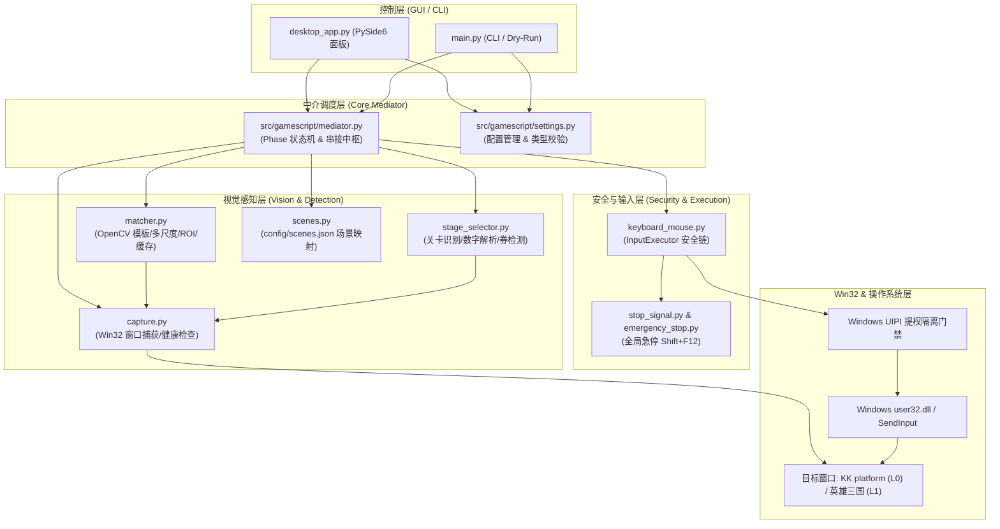

# GameScript-Local 系统架构文档

> **生成日期**：2026-08-08  
> **生成模型**：gemini-3.6-flash  
> **项目版本**：GameScript-Local 2.0 (重构版)  
> **适用范围**：KK 对战平台《重生魔兽刷刷刷》纯视觉 + 系统级输入自动化挂机系统

---

## 1. 系统整体架构

GameScript-Local 采用分层解耦架构，从上至下分为 **GUI/CLI 控制层**、**中介调度层 (Mediator)**、**视觉感知层 (Vision)**、**安全与输入执行层 (Input & Security)** 以及 **Win32/UIPI 系统层**。



---

## 2. 模块职责表

| 模块路径 | 核心类 / 函数 | 行数 / 规模 | 职责描述 |
|---|---|---|---|
| `src/gamescript/mediator.py` | `Mediator`, `Phase`, `ChallengeState` | ~2330 行 | 系统的核心中枢与主状态机。控制 L0（大厅/建房/房间/选关）与 L1（主线/卡牌/四挑战/进化/神器/退出）全流程调度；集成 Fail-Closed、静态帧复用、多锚点战后判别与英雄模式。 |
| `src/gamescript/input/keyboard_mouse.py` | `InputExecutor`, `ActionResult`, `click`, `right_click`, `press_key`, `hotkey`, `paste_text`, `type_text`, `scroll` | ~580 行 | 负责输入注入及安全检查。执行 UIPI 管理员权限校验、HWND 句柄有效性、前台焦点确认、`WindowFromPoint` 遮挡检测及急停信号检查。 |
| `src/gamescript/input/emergency_stop.py` | `EmergencyStopListener` | ~80 行 | 后台全局热键监听器。监听 `Shift+F12` 并触发 `StopSignal` 强制中断所有正在执行的输入与主循环。 |
| `src/gamescript/stop_signal.py` | `StopSignal` | ~50 行 | 线程安全的急停信号共享对象，提供 `trigger()`, `is_set()`, `reset()` 接口。 |
| `src/gamescript/vision/capture.py` | `Frame`, `WindowTarget`, `check_frame_health`, `capture_target`, `capture` | ~640 行 | Win32 窗口查找与截屏捕获。支持客户端区域 (Client Area) 屏幕坐标转换、窗口黑帧/低熵/陈旧帧/冻结帧健康度检查。 |
| `src/gamescript/vision/matcher.py` | `MatchResult`, `match_one`, `match_any`, `match_all`, `find_blue_buttons`, `find_input_boxes` | ~450 行 | 基于 OpenCV (`cv2.matchTemplate`) 的模板匹配引擎。支持 0.85~1.2 尺度缓存 (`_SCALE_CACHE`)、ROI 局域匹配、卡牌品质 HSV 颜色评分。 |
| `src/gamescript/vision/stage_selector.py` | `StageId`, `StageRow`, `visible_stage_rows`, `find_stage_in_range`, `verify_stage_selection` | ~400 行 | 关卡识别与交互。通过数字字形匹配解析关卡编号行，计算选关点击坐标；识别扫荡券剩余数量（`ticket_zero` 模板）。 |
| `src/gamescript/vision/scenes.py` | `load_scenes`, `scene_templates` | ~80 行 | 加载解析 `config/scenes.json`，提供场景 key 到模板列表的字典映射。 |
| `src/gamescript/settings.py` | `Settings` | ~250 行 | 全局配置数据结构。提供配置项类型强制转换、自动保存、与官方 `Settings.json` 的字段双向映射。 |
| `src/gamescript/monitor_game_over.py` | `GameOverMonitor` | ~120 行 | 基于滑动窗口像素熵与标准差检测游戏窗口静止/卡死状态（独立备用模块）。 |
| `src/gamescript/loop_action.py` | `LoopAction` (Enum) | ~15 行 | 定义主循环迭代返回值（`Continue` / `Break`）。 |
| `desktop_app.py` | `MainWindow` (PySide6) | ~600 行 | 本地 GUI 控制面板。支持技能/卡牌拖拽配置、英雄模式参数设置、实机运行日志实时回显。 |
| `main.py` | CLI 入口 (`cmd_run`, `cmd_dry_run`, `cmd_match` 等) | ~150 行 | 命令行运行入口，支持免 GUI 运行模式与图像匹配诊断工具。 |

---

## 3. 端到端数据流 (Data Flow)

一个完整的自动化控制 Loop 遵循 **“捕获 → 健康判断 → 上下文分类 → 阶段决策 → 安全拦截 → Win32 注入 → 结果反馈”** 数据管道：

```
+-----------------------------------------------------------------------------------+
| 1. Frame 捕获与对齐                                                               |
|   Mediator.see() -> capture_best() -> capture_target()                            |
|   获得当前 HWND 客户端区域 BGR 图像、位置 (left, top) 及尺寸 (width, height)             |
+-----------------------------------------------------------------------------------+
                                          |
                                          v
+-----------------------------------------------------------------------------------+
| 2. Frame Observation & 健康检查                                                    |
|   check_frame_health(frame, prev_frame) -> FrameHealthResult                      |
|   - 异常帧 (capture_failed, black_frame, low_entropy) -> 跳过决策，启动超时等待        |
|   - 静态/陈旧帧 (frozen, old_frame) -> 坐标可信，放行决策                            |
|   - 静态帧复用判断: (bgr 相等 && 位置相同) -> 命中 _last_frame 对象                     |
+-----------------------------------------------------------------------------------+
                                          |
                                          v
+-----------------------------------------------------------------------------------+
| 3. Phase Handler & 上下文分类 (Context Classification)                           |
|   _detect_context(frame) -> "STAGE_SELECT" / "ROOM_WAITING" / "MAIN_LINE" 等        |
|   _scene_cache 缓存命中 (单 Tick 相同帧场景查找消耗降至 0.000s)                       |
|   Phase 状态机分流 -> _tick_l0() / _tick_main_line() / _tick_hero_setup()         |
+-----------------------------------------------------------------------------------+
                                          |
                                          v
+-----------------------------------------------------------------------------------+
| 4. 产生动作意图 (Intent Generation)                                                |
|   MatchResult / Key Intent (如 left_click @ (x, y), press_key('g'), scroll(-5))     |
+-----------------------------------------------------------------------------------+
                                          |
                                          v
+-----------------------------------------------------------------------------------+
| 5. InputExecutor 安全拦截链 (6 重安全门禁)                                          |
|   [Gate 1] Emergency Stop: stop_signal.is_set()?                              |
|   [Gate 2] Dry-Run check: dry_run == True? (仅打印坐标)                           |
|   [Gate 3] UIPI Elevate: is_current_process_elevated()? (非管理员拦截)            |
|   [Gate 4] HWND Valid: target_hwnd 存在且未最小化?                               |
|   [Gate 5] Foreground Check: target_hwnd 是否在最前台? (否则 activate_window)     |
|   [Gate 6] Occlusion Check: WindowFromPoint(x, y) == target_hwnd? (遮挡拦截)      |
+-----------------------------------------------------------------------------------+
                                          |
                                          v
+-----------------------------------------------------------------------------------+
| 6. Win32 底层注入与 ActionResult                                                   |
|   SetCursorPos(x, y) + SendInput(MOUSEEVENTF_LEFTDOWN | LEFTUP)                       |
|   返回 ActionResult(success=True/False, status="SUCCESS", message=...)            |
+-----------------------------------------------------------------------------------+
                                          |
                                          v
+-----------------------------------------------------------------------------------+
| 7. 下一帧验证 & 状态推进                                                           |
|   LoopAction.Continue (进入下一 Tick 冷却或等待) / LoopAction.Break (异常停机)      |
+-----------------------------------------------------------------------------------+
```

---

## 4. 关键机制分析

### 4.1 Fail-Closed 原则 (故障闭锁)
系统始终恪守 Fail-Closed 设计原则：
- **未知页面**：若屏幕出现无法识别的弹窗或未知上下文，脚本**绝不盲目点击**，保持零输入（Zero Input）等待直到超时。
- **未匹配卡牌**：在三选一卡牌/技能面板中，若既无用户配置匹配，又无品质色识别结果，主动打开的面板会点击「放弃/暂时隐藏」安全关闭；非主动打开的未知面板等待 10s 后直接切入 `Phase.ERROR` 并停机。
- **重试上限**：所有关键操作（自动任务勾选、四挑战开启、胜利结算点击、建房/选关按钮重试）均设有严格的重试计数器（通常 3 次）。超过上限立即切入 `Phase.ERROR` 并停止主循环，绝不无限循环攻击 UI。

### 4.2 遮挡检测机制 (Occlusion Detection)
针对游戏窗口被编辑器、终端或第三方弹窗部分覆盖的实机场景：
- 输入前调用 `InputExecutor._check_point_obscured(target_hwnd, x, y)`。
- 通过 Win32 API `WindowFromPoint(POINT(x, y))` 实时获取目标坐标点上最顶层的 HWND。
- 校验该 HWND 的 PID/HANDLE 是否与目标游戏窗口匹配。若点位被其他进程窗口遮挡，立即取消点击并返回 `CANCELLED_WINDOW_OBSCURED`，防止点击事件误落入其他应用。

### 4.3 静态帧复用与多级缓存 (Static Frame Reuse & Caching)
- **静态帧复用**：当连续截屏的图像像素 (`np.array_equal`) 与窗口位置 (`left`, `top`) 完全一致时，`Mediator.see()` 直接复用上一帧 `Frame` 对象，保留原时间戳，使 `check_frame_health` 正确判定为 `frozen/old_frame`（放行坐标可信的静态识别）。
- **帧内场景缓存**：`Mediator._scene_cache` 针对单帧对象缓存 `find_scene` 结果，消除了单 Tick 内分类器与动作处理器重复扫描图像的性能开销（`detect_context` 从 4.5s 骤降至 0.000s）。
- **模板与尺度缓存**：`matcher.py` 中的 `_TEMPLATE_CACHE` 缓存原始图像，`_SCALE_CACHE` 缓存 0.85 ~ 1.2 范围的缩放图像，避免实时缩放重绘的 CPU 浪费。

### 4.4 跨局状态重置 (Cross-Game Reset)
为防止上一局的挂机标志残留在下一局引发误判：
- 当状态机切入 `Phase.STAGE_SELECT` 或 `Phase.MAIN_LINE` 时，`Mediator.set_phase()` 自动重置所有内部状态。
- **重置项包括**：`_stage_selected`（选关标志）、`_challenge_done` / `_challenge_states`（四挑战开启状态）、`_auto_task_done`（自动任务勾选状态）、`_panel_opened_by_us`（主动面板标记）、`_artifact_next_q/w/e`（神器 CD 时间戳）及 `_evolve_click_cooldown_until`（进化冷却）。

### 4.5 扫荡券检测与考古切断 (Sweep Ticket Detection)
在选关页 (`STAGE_SELECT`) 具备自动化止损与切换机制：
- 识别选关页底栏扫荡按钮下方的剩余券数区域（坐标 ROI `(862/1600, 850/900)` 至 `(920/1600, 888/900)`）。
- 使用 `lobby/ticket_zero` 模板比对。若连续 3 帧确认剩余扫荡券为 `0`：
- 脚本自动点击底栏 `考古模式` 按钮 (`(1376, 813)`)，随后触发 `Phase.QUIT` 并安全结束主循环。

### 4.6 UIPI 提权隔离门禁 (UIPI Elevation Protection)
- Windows UIPI (User Interface Privilege Isolation) 机制会**静默丢弃**由低权限进程向高权限进程发送的 SendInput 消息。
- 由于 KK 平台与游戏地图均自带 `requireAdministrator` 提权清单，若挂机脚本以非管理员启动，输入将完全失效。
- `InputExecutor.check_can_execute()` 内置提权校验 `is_current_process_elevated()`，非提权运行时拒绝执行任何真实 SendInput 注入，并在 CLI/GUI 显著报错提示。

---

## 5. 项目完整文件索引

```
GameScript-Local/
├─ desktop_app.py                   # PySide6 面板程序 (配置 UI / 技能面板 / 日志)
├─ main.py                          # CLI 脚本命令行入口 (run / dry-run / match)
├─ api_server.py                    # Web API 调试服务端 (可选)
├─ GameScript.spec                  # PyInstaller 打包配置文件 (uac_admin=True)
├─ build_release.ps1                # PowerShell 一键构建与打包脚本
├─ requirements.txt                 # 基础依赖清单
├─ requirements-desktop.txt         # GUI 桌面版依赖清单
├─ requirements-build.txt           # 打包构建依赖清单
├─ config/
│  ├─ default_settings.json         # 默认运行配置
│  └─ scenes.json                   # 场景与模板映射配置文件 (130+ 场景)
├─ src/
│  └─ gamescript/
│     ├─ mediator.py                # 中介调度器 (主状态机 / 核心流程控制)
│     ├─ settings.py                # 配置类 (JsonSettingsBase)
│     ├─ monitor_game_over.py       # 游戏卡死/静止帧熵监控
│     ├─ stop_signal.py             # 线程安全急停信号
│     ├─ loop_action.py             # 主循环动作枚举
│     ├─ input/
│     │  ├─ keyboard_mouse.py       # InputExecutor 输入执行器 & 6 重安全链
│     │  └─ emergency_stop.py       # Shift+F12 全局热键监听器
│     └─ vision/
│        ├─ capture.py              # Win32 窗口截屏 / 坐标转换 / 健康度检查
│        ├─ matcher.py              # OpenCV 模板匹配 / 尺度缓存 / HSV 色阶
│        ├─ stage_selector.py       # 关卡数字行解析 / 选关验证 / 扫荡券检测
│        └─ scenes.py               # scenes.json 加载器
├─ assets/Images/                   # 313 个识别模板 (skills / cards / lobby / challenges)
├─ fixtures/                        # 实机截图与自动化测试回放夹具
│  ├─ live_e2e_20260807/            # 端到端全流程截图
│  └─ live_postgame_20260808/       # 战后/大秘境/英雄模式关键帧
├─ tests/                           # 单元测试与 P0/P1 自动化验证套件
│  ├─ test_p0_security.py           # P0 安全拦截链测试 (急停/遮挡/提权/前台)
│  ├─ test_p0b_replay.py            # 实机截图全回放基线测试 (32 夹具)
│  ├─ test_p1a1_main_line_controls.py # P1 主线控制测试 (自动任务/四挑战)
│  ├─ test_p1a2_challenge_controls.py # P1 挑战控件细节测试
│  ├─ test_p1b0_post_game.py        # P1 战后多锚点页面判别测试
│  ├─ test_hero_mode_temporal.py    # 英雄模式 (肯瑞托 1-5 级) 时序测试
│  ├─ test_stage_selector.py        # 关卡选择与滚动测试
│  └─ test_desktop_app.py           # PySide6 面板逻辑测试
└─ docs/                            # 项目设计与架构文档
   ├─ AI_REVIEW_CONTEXT.md          # 供 AI 审查的上下文与反作弊确认
   ├─ ARCHITECTURE_20260808.md       # [本文件] 系统架构与数据流文档
   ├─ DEVELOPMENT_GUIDE.md          # 开发指南与调试规范
   ├─ LIVE_FLOW_BREAKDOWN_20260808.md # 录屏逐帧拆解数据
   └─ agent_digs_20260808/          # 原版 IL 逆向拆解与解密报告
```
