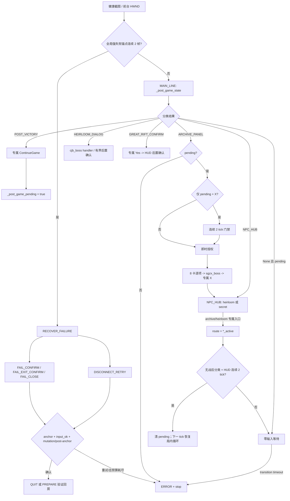

# 战后、恢复与看板架构复审（2026-09-01）

审查基线：`trial-merge@ce007c5`。工作目录仅使用
`G:\刷刷宝\GameScript-Local`；未在其他 worktree 修改文件。

## 结论

- P1-a 已加固：`archive_active` / `heirloom_active` 不再由单帧通用 HUD 清除
  `_post_game_pending`，必须连续 2 tick 都满足“无战后分类 + 局内 HUD”。第一帧严格零输入，
  第二帧确认后也延迟到下一 tick 才恢复局内动作。
- P1-b 已加固：`ARCHIVE_PANEL` 若只有 `_post_game_pending + 右上角 X`，且没有标题、
  8 卡完成态或 archive scene 等存档证据，必须连续 2 tick 才能进入 4x2 卡位 handler。
  有存档强证据的真实面板仍即时分类，不增加正常链路延迟。
- `_advance_recovery` 保持原设计：每一步都要求前置锚点、输入成功和画面 mutation/后置锚点；
  重试与总时限有界，耗尽即 ERROR，未发现需要跨层修改的问题。
- `DashboardFacade` 的三项战后配置、持久化、Runner 单入口和订阅门禁已完整接线；本轮没有改外壳层。

## 状态与门禁图



核心授权边界：

1. `post_game_pending=False` 时，存档面板或挑战广场只能 fail-closed，不能获得卡位/NPC 点击权。
2. 存档 4x2 固定卡位只在已分类 `ARCHIVE_PANEL` 内可达；右上角 X 本身不是立即授权。
3. 传家宝只消费 `cjb_boss`，时光之穴只消费 `sgzx_boss`；配置目标失败后只能使用已识别模板的
   “最后可见 Boss”，没有模板命中时继续零输入。
4. 大秘境必须依次经过受锚定 NPC 右键、确认框“是”、局内 HUD 后置确认；广场过渡帧不能重复右键。
5. `UNKNOWN`、缺锚点、输入拒绝和后置确认失败均不猜点。

## P1-a：挑战入口后的 HUD 确认

旧逻辑在 `route in {archive_active, heirloom_active}` 时，只要单帧 `_is_in_game_hud=True`
就清除 pending。该 HUD 判定包含常驻环境锚点、选择面板和四挑战场景，适合作为“已回局内”的
通用证据，但单帧不足以排除加载叠帧。

故障方向原本仍偏安全：若过早清 pending，随后真正的存档/传家宝面板会因 pending 缺失进入
`unexpected ... -> ERROR`，而不是继续盲点；但误判当 tick 仍可能放行局内 handler。两帧确认仅增加
一个零输入 tick，且任一中断帧归零，收益大于延迟成本，因此落地加固。

新增回归：`test_active_archive_route_requires_two_consecutive_hud_frames`。新增状态字段已同步到
契约 C2 的 `INGAME_POLLUTION`。

## P1-b：pending-only 存档分类

对 `fixtures/` 下全部 1,963 张 PNG/JPG/JPEG 真实素材运行生产
`_find_archive_panel_close`（阈值、ROI、尺度均未改写）：

| 扫描结果 | 数量 | 分类结果 |
| --- | ---: | --- |
| X 模板命中 | 22 | 8 张存档/存档叠层、9 张传家宝、4 张胜利、1 张 KK 房间已满 |
| 解码错误 | 0 | 无 |
| 非游戏弹窗碰撞 | 1 | `lobby_hitch_detail_20260814/t0046.00.png` 的通用 `close` |

传家宝与胜利素材均被其更高优先级专属锚点先行分类。KK“房间已满”属于平台窗口，正常情况下受
HWND/阶段边界隔离，不会带着 MAIN_LINE 的 pending 进入此 handler；但它证明通用 X 不是唯一证据，
因此 pending-only 路径加连续 2 tick 门禁。

另有真实叠层帧
`fixtures/y3_screenrecord_20260814/重生魔兽刷刷刷-260809144122/frames/t0002.00.png`：
胜利奖励覆盖在存档底图上，旧 `continueGame` 模板未命中，但底图存档锚点命中。该录像帧的实际状态
是 `pending=False`，生产行为为 `unexpected archive panel -> ERROR`，不会点击；没有证据证明当前版本
会在 `pending=True` 后连续保留该叠层，因此不把它写成实机 PASS，也不据此扩展新的视觉模板。

新增回归：`test_pending_only_archive_panel_requires_two_consecutive_ticks`。该测试验证门禁逻辑，
不冒充真机证据。

## 恢复链复审

`_tick_impl` 对 `fail` / `disconnect` 先做连续 2 帧强证据确认，再进入 `RECOVER_FAILURE`。
`_tick_recovery` 的动作门闩为：

```text
前置锚点存在 -> 专属动作存在 -> act_click 成功
-> 等待模板消失或后置锚点出现 -> _advance_recovery
```

- 失败页可走红色专属退出、左上退出 + 标准确认，或 OK 后 close；红色兜底受 `gameFail` 下沿按钮带约束。
- 断线只走断线重试锚点；缺真实断线素材的 `disconnect_modal_missing` 继续是 BLOCKED。
- 每步最多取配置与 3 的较小值，总流程受 `recovery_timeout_s` 限制；失败后记录 incident 并停止。
- 大厅“进房/建房禁止颜色兜底”的 C4 红线没有被恢复链放宽；这是不同的强失败上下文。

## DashboardFacade 与配置接线

```text
ui-v2 / 原生窗口
  -> DashboardFacade.update_config（Settings.validate_patch，全量拒绝非法 patch）
  -> collect_persistable_settings + _shell 原子替换
  -> validate_preflight
  -> check_start_permission（订阅门禁）
  -> RunnerService.start（唯一 LIVE 入口）
  -> 生产 Mediator
```

- `config/mode_specs.json:normal_farm.visible_settings` 已包含
  `cjb_boss`、`sgzx_boss`、`auto_secret_realm`。
- Web UI 分别写回 `cjb_boss` / `sgzx_boss`，恢复持久化值时覆盖推荐展示；原生窗口同样读写三项设置。
- 显式环境卡密优先于磁盘卡密；激活成功必须先保存，再写进程环境；启动前再次检查权限。
- Facade 不直接操作 `api_server` 或 `runtime_mediator`，没有复制战后 FSM。

## 仍需真机复验

- 新增两帧门禁改变了时序，因此存档入口和传家宝入口各需至少一次当前 SHA 的
  `入口点击 -> 过渡 -> 连续 HUD -> active/completion` 复验。
- 时光之穴完整 NPC 入口链、大秘境 `_secret_realm_active=True` 当前 SHA 证据仍不足，不升级历史状态。
- `disconnect_modal_missing` 继续 BLOCKED；没有真实素材前不得用合成帧更新结论。

## 离线验证

- 定向回归：`159 passed, 27 subtests passed`。
- 全量 pytest 的断言结果：`1117 passed, 1 skipped, 2 xfailed, 207 subtests passed`。
  Windows/Qt WebEngine 在打印完整摘要后出现既有 profile 释放警告并残留进程，人工终止后 shell
  退出码为 1；这是测试进程 teardown 问题，不改快照、不记作干净退出。
- 正式发版门禁：`python tools/release_gate.py` 四阶段 `4/4 PASS`：pytest 344、冻结回放、
  scene/templates（132 场景、367 资产）、contract 56。冻结回放中的
  `disconnect_modal_missing=BLOCKED` 保持基线，不伪装成 PASS。
