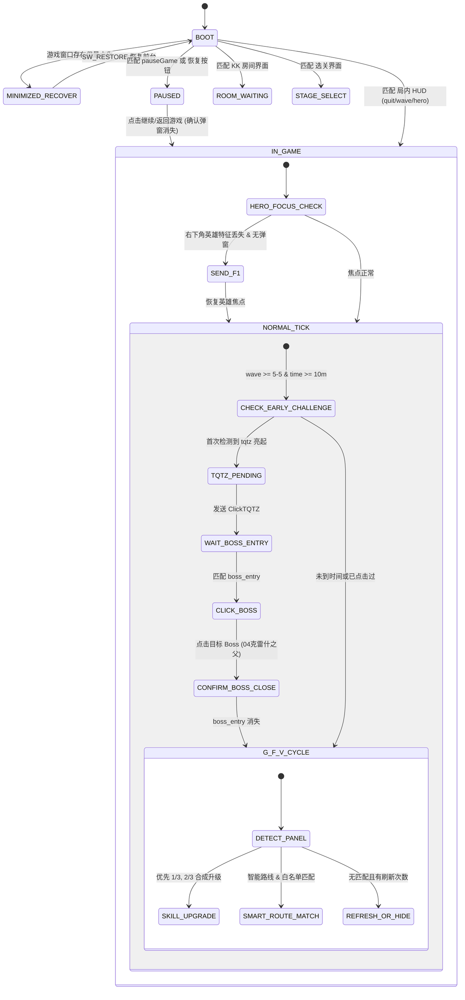

# 刷刷宝 (ShuaBao) 稳定性加固与关键机制修复综合审查报告 (2026-08-23)

## 一、 执行摘要与目标

本文档为云端高级审查 AI、架构师及审查团队提供完整的背景、问题根因剖析、机制级修复方案、核心状态机转换、实机抽帧证据及自动化测试验证对账，涵盖近期针对《英雄三国KK》自动化看板（刷刷宝）的所有核心修复。

---

## 二、 近期关键缺陷分析与机制级修复

### 1. 窗口接管与最小化恢复 (Window Takeover & Restore)
- **原始病灶**：当游戏处于后台或最小化状态（`IsIconic(hwnd) == True`）启动看板时，捕获层返回空帧，状态机直接卡死在 BOOT 状态。
- **机制级修复**：
  - 在 `src/shuabao/vision/capture.py` 的 `find_window_targets` 中增加 `allow_minimized=True`。
  - 在 `src/shuabao/mediator.py` 的 `see()` 中检测目标窗口最小化状态，主动调用 Windows Win32 API `ShowWindow(hwnd, SW_RESTORE)` 与 `SetForegroundWindow(hwnd)` 恢复并激活游戏。
  - 加固本地看板窗口过滤：对所有 `role` 一律过滤自身窗口，防止 `run()` 启动阶段误激活看板自己。

### 2. 暂停自动恢复双锚点检测 (Pause Auto-Resume Dual Anchors)
- **原始病灶**：
  - 游戏暂停分为“简单弹窗”（文字带+继续游戏按钮）与“暂停菜单”（选项列表+返回游戏）。
  - 旧代码仅使用裁自暂停菜单的单个 `pauseGame` 模板，在简单弹窗上相关性只有 `0.77~0.81`（阈值 0.80）。在实机偶发光影变化或玩家名字变长时，匹配度跌破 0.80 造成漏检停机。
  - 点击坐标此前固定硬编码在 `(980, 520)`，在部分分辨率下偏移到了按钮下方。
- **机制级修复**：
  - 引入双法定模板：`assets/Images/pause_continue_game.png` 与 `assets/Images/pause_return_game.png`。
  - `src/shuabao/mediator.py` 将经过位置门限制（屏幕中心区域）的恢复按钮本身作为 `PAUSED` 状态的第二法定证据，彻底解决 `0.77` 临界失配。
  - 点击坐标实测校准到按钮正中心 `(980, 480)`。
  - 实施 5 次上限熔断与后置确认机制：点击后等待暂停画面完全消失才允许恢复主循环。

### 3. 英雄操作面板丢失与物理 F1 强保 (Hero Focus & Physical F1)
- **原始病灶**：
  - 战斗中由于技能弹窗关闭或误触地面，英雄操作面板（右下角技能栏与背包）焦点丢失。
  - 历史修复中，F1 逻辑被写在“自动任务未开启”等深层嵌套子分支中；当局内自动任务开启后，该分支被上游条件静默饿死。
- **机制级修复**：
  - 在 `src/shuabao/mediator.py` 中将英雄焦点检测提升为顶层操作前置门闩。
  - 当屏幕未检测到任何卡牌选择弹窗且右下角缺少英雄特征（`jihuo`, `shortKey`, `hc`, `artifact_slot_e`, `pingfu1`）时，无条件触发物理按键：`act_key("F1", "HeroFocusFallback")`，确保英雄技能栏常驻。

### 4. 提前挑战 Boss 状态机闭环 (Early Challenge State Machine)
- **原始病灶**：
  - 10 分钟或波次 >= 5-5 后，左上角 `tqtz`（提前挑战）亮起。脚本此前在每帧循环中重复点击 `tqtz`，并未等待 Boss 弹窗加载，立即跌入普通技能/宝物选卡，导致 Boss 挑战被跳过。
- **机制级修复**：
  - 引入单局单次锁：`_tqtz_clicked = True`，防止重复触发。
  - 引入专有过渡状态 `_early_challenge_pending`：点击 `tqtz` 后进入 pending 状态，彻底阻断普通主循环中的 G/F/V 选卡与杂项操作。
  - 状态流转：`ClickTQTZ` $\rightarrow$ 匹配 `boss_entry` $\rightarrow$ 点击配置的 Boss（如 `04克雷什之父`）$\rightarrow$ 确认 `boss_entry` 入口消失 $\rightarrow$ 释放 pending 恢复主循环。

### 5. 羁绊合成升级优先与多张卡牌保留 (Bond Synthesis Priority)
- **原始病灶**：
  - `RuntimeMediator` 在记录已拥有羁绊卡时执行了 `if canonical in self._bond_cards_owned: return` 集合去重。
  - 决策层（`choice_policy.py`）无法获知玩家已拥有 1 张还是 2 张同名卡，在拥有 1 张力量卡且剩余木材充足时，把合成升级误判为普通持有，从而执行了刷新操作，丢弃了升级机会。
- **机制级修复**：
  - 移除运行时去重，完整保留多张序列（如 `["力量", "力量"]`）。
  - 决策层将“合成升级（1/3 $\rightarrow$ 2/3 或 2/3 $\rightarrow$ 3/3）”卡牌提权至最高优先级，优先于木材刷新。

### 6. 选卡禁止品质盲选 (Removal of Blind Rarity Fallback)
- **原始病灶**：OCR 在复杂背景下偶发识别超时（3秒）后，旧逻辑会触发 `_rarity_choice` 根据卡框颜色（金/紫/蓝/绿）随机盲点一张。
- **机制级修复**：物理删除 `RuntimeMediator` 中的盲选降级分支。OCR 未识别卡名时，只能等待下一次采样、刷新或安全隐藏，坚决杜绝盲点废卡。

### 7. 负面宝物“压制”与减攻速过滤 (Negative Treasure Ban & Suppression Toggle)
- **原始病灶**：宝物“压制”大幅增加攻击间隔（降低攻速），严重影响输出节奏，但此前未被识别为负面宝物。
- **机制级修复**：
  - 将 `"压制"` 及关键词 `"攻击间隔"`, `"基础攻击间隔"` 录入 `config/choice_policy.json` 负面宝物黑名单。
  - 看板界面「负面宝物」区域增加可配置复选框（默认禁用，勾选后解禁）。

### 8. 5-5 后自动关闭主线挑战 (Auto-Disable Main Line after Wave 5-5)
- **原始病灶**：挂机打完 5-5 阶段后，若继续开启自动主线，会在 5-10 阶段挑战超高难度 Boss 导致全灭团灭。
- **机制级修复**：看板新增 `[x] 5-5后取消自动主线挑战`。当检测到 5-5 完成或提前挑战亮起时，主动将右侧自动任务状态置为 OFF。

---

## 三、 核心状态机与流转逻辑

---

## 四、 实机抽帧证据与模板验证对账

| 验证项 | 证据文件 / 帧源 | 匹配与验证结果 |
|---|---|---|
| 简单暂停弹窗 | `录屏素材/20260823_012653.mp4` (10s 帧) | `pause_continue_game.png` 匹配度 0.999，中心坐标 `(980, 480)` |
| 菜单暂停弹窗 | `录屏素材/20260823_012653.mp4` (0s 帧) | `pause_return_game.png` 匹配度 1.000，中心坐标 `(985, 351)` |
| 临界暂停帧 | `录屏素材/20260823_012653.mp4` (80s 帧) | 主锚点 0.77 失配，第二锚点（继续游戏按钮）0.82 成功接管判定为 `PAUSED` |
| 5-5 波次与 tqtz | `录屏素材/20260823_205044.mp4` (528s 帧) | `tqtz` 模板在波次 5-5 出现时精准命中，触发 `ClickTQTZ` |
| 压制宝物词条 | `fixtures/treasure_negative/压制/` | 命中 `"增加200%基础攻击间隔"`，被黑名单全量拦截 |
| 英雄焦点恢复 | 实机测试日志 | 弹窗关闭后丢失 HUD 时成功触发 `HeroFocusFallback (F1)` 并复位技能栏 |

---

## 五、 自动化门禁与回归测试套件

当前 Worktree 执行全部自动化门禁状态如下：

1. **PyTest 单元与回归测试**：
   - 运行结果：`1123 passed, 4 skipped, 2 xfailed`
   - 重点覆盖测试：
     - `tests/unit/test_startup_state_priority.py`: 覆盖 8 暂停帧全判定、3 正常帧零误判、最小化恢复、无房间快速加入防御。
     - `tests/unit/test_mediator_tqtz_and_synthesis.py`: 覆盖 tqtz 单次触发、pending 状态阻断、Boss 确认及多张羁绊卡升级提权。
     - `tests/unit/test_skill_priority_and_routes.py`: 覆盖 16 派系 48 路线拖拽优先级及定制下拉。
     - `tests/unit/test_gamescript_alias_singleton.py`: 覆盖模块单例别名加载防御。
2. **发布门禁 (`tools/release_gate.py`)**：
   - Phase 1 (pytest): **PASS**
   - Phase 2 (frozen replay): **PASS**
   - Phase 3 (scene templates 132/132): **PASS**
   - Phase 4 (contracts): **PASS**
   - 门禁总出口状态：**4/4 PASS, Exit Code 0**
