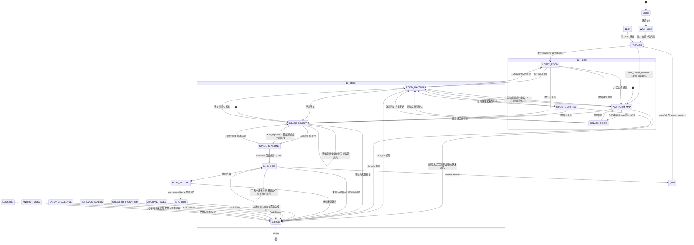

# 英雄三国挂机 · 全流程状态机与异常对策

> **用途**：本地重构对齐基线（只读梳理，不改代码）  
> **坐标基准**：游戏窗 **1600×900** 内像素（来源 `docs/LIVE_FLOW_BREAKDOWN_20260808.md`；agent 原按 1920×1080 标注，已 ×1600/1920；真机点击需再加窗口屏幕偏移）  
> **不确定项**：标 `UNKNOWN`  
> **对照源**：
> - docs/SUCCESS_FLOW.md
> - docs/LOBBY_ROOM_GAP.md
> - docs/LOGIC_ROOM_STAGE_REP_SKILL.md
> - docs/ORIGINAL_1_3_8_BEHAVIOR_MATRIX.md
> - docs/LIVE_FLOW_BREAKDOWN_20260808.md
> - src/gamescript/mediator.py（Phase / `_tick_l0` / `_tick_main_line` / `_tick_l1_tail`）
> - config/scenes.json（method_pipeline / priority / scenes）

---

## 0. 两层世界（L0 / L1）

```
L0 大厅/房间（KK 平台窗口关键字）
  BOOT → WAIT_EXIT → [PLATFORM_MAP → CREATE_ROOM] → ROOM_WAITING → ROOM_STARTING
       → STAGE_SELECT → STAGE_STARTING
                │ 加载成功 / 出现局内 UI
L1 局内（游戏窗口关键字）
  MAIN_LINE（选卡/技能/自动任务/四挑战）
  → [EARLY_CHALLENGE / ANCHOR_BOSS / LONGZHU]  ← 本地多为 Fail-Closed
  → 战后 POST_VICTORY / NPC_HUB / ARCHIVE / 秘境
  → QUIT / NEXT → 回到 L0 PREPARE
```

| 层 | 窗口 | 主要 Phase | 模板密度 |
|----|------|------------|----------|
| L0 | KK 平台 | BOOT…STAGE_STARTING | 少（room_start / create_room / stage_*） |
| L1 | 英雄三国 | MAIN_LINE…QUIT | 多（cards/skills/challenges/boss…） |

**官方模式语义（CONFIRMED by 帮助原文）**

| GameMode | 名称 | 房间/开始 |
|----------|------|-----------|
| 0 | 独狼 | **用户自己点房间开始**；本地可补「房间内识别开始」 |
| 1 | 带队/车头 | 自动建房+房间开始（`RoomName`/`RoomPassword`/`NewRoomEveryTimes` 仅此模式有效） |
| 2 | 赌木 | 主线+第一宝物等（细节部分 UNKNOWN） |
| 3 | 邪修秘境 | 其它功能关，偏 Boss（细节部分 UNKNOWN） |

本地：`auto_create_room=true` **或** `game_mode==1` → `_auto_room_enabled()`。

---

## 1. Mermaid 状态图



**官方成功日志（对照，非本地 Phase 名）**

```
验证环境成功 → 等待所有人退出 → 开始游戏/准备 → 已经准备
→ 等待进入游戏UI → 开始主线 → 卡都找完了 → (集火失败→F1)
→ 提前挑战? → 锚点Boss → 龙珠 → 大秘境? → QuitGame → 下一局
```

---

## 2. 全局判定优先级（scenes.json `priority`）

任意 tick 中，**场景命中优先级**（高→低）：

| 序 | key | 含义 | 本地处理 |
|----|-----|------|----------|
| 1 | disconnect | 断线弹窗 | → QUIT，点 fail/ok/close |
| 2 | fail | 失败/放弃 | 同上 |
| 3 | pause | 赌木暂停 | log only |
| 4 | ok | 通用确认 | 随上下文 |
| 5 | create_room_confirm | 建房确认 | CREATE_ROOM |
| 6 | room_start | 房间开始 | ROOM_WAITING |
| 7 | stage_start | 选关底栏开始 | STAGE_SELECT 后 |
| 8 | map_create_room | 地图创建房间 | PLATFORM_MAP |
| 9 | card_panel | 卡牌面板 | MAIN_LINE |
| 10 | skill_panel | 技能面板 | MAIN_LINE |
| 11 | stage_page | 选关页标识 | STAGE_SELECT |
| 12+ | longzhu / treasure / wood / secret / boss_entry / archive / clean / close | 局内/战后 | 多数战后 **Fail-Closed** |

**上下文分类 `_detect_context`（mediator）**（与 priority 互补）：

1. 选择面板锚点 → `MAIN_LINE`
2. disconnect/fail → `QUIT`
3. **选关编号行**（优先于 room_start，防底栏开始钮误匹配房间开始）→ `STAGE_SELECT`
4. room_start → `ROOM_WAITING`
5. 局内 HUD（card/skill/四挑战/env_anchor）→ `MAIN_LINE`
6. 建房确认 → `CREATE_ROOM`
7. 自动建房且地图创建钮 → `PLATFORM_MAP`
8. else → `UNKNOWN`

**窗口角色**

- L0 相位截 KK 关键字；L1 截游戏关键字  
- 多 HWND：按场景锚点打分选窗；同级保持上次已验证 HWND  
- **仅** `dry_run=false` 且将要点击/滚动/按键时才激活目标窗

---

## 3. 分阶段表

### 3.1 L0 进房链路

| 阶段 | 判定条件（模板/上下文） | 动作（点击/滚轮/坐标） | 超时行为 | 下一阶段 | 本地实现 |
|------|-------------------------|------------------------|----------|----------|----------|
| **BOOT** | 进程启动；可探测双窗信号 | 选截屏角色；无输入 | — | WAIT_EXIT / 由 context 跳 L0 | ✅ `Phase.BOOT`，`run()` 入口 |
| **WAIT_EXIT** | 「等待所有人退出」语义 | 无强制动作；靠 context 分流 | UNKNOWN（官方有门闩） | PREPARE / 直接进 `_tick_l0` 分流 | ⚠️ 枚举有；**无独立等待逻辑**，并入 `_tick_l0` 入口分支 |
| **PREPARE** | 开始/准备 | 旧路径会点 `start`；新 L0 不盲点 | — | LOBBY_ROOM / PLATFORM_MAP | ⚠️ 枚举有；实际由 `_tick_l0` 按 context 重定向 |
| **LOBBY_ROOM** | 无自动建房；未见房间开始 | **不** F1、**不**全局蓝钮兜底；只等识别 | 保持等待 | ROOM_WAITING / STAGE_SELECT / CREATE_ROOM / PLATFORM_MAP | ✅ |
| **PLATFORM_MAP** | `_auto_room_enabled`；地图创建钮 | 点 `map_create_room` 或底部 ROI 蓝钮（`room_create_side`）；**拒点快速加入**（需≥2 蓝候选才色兜底，见 LOBBY 文档） | `query_timeout` → ERROR 停机 | CREATE_ROOM / ROOM_WAITING / STAGE_SELECT / ERROR | ✅ |
| **CREATE_ROOM** | 弹窗≈584×488；底 ROI 确认 + **两个相似输入框** | 填 `room_name`/`room_password`（非 dry-run 才粘贴）→ 点确认 | 超时 → 回 PLATFORM_MAP（不假报成功） | ROOM_WAITING / PLATFORM_MAP | ✅ 严格 ROI；不安全则停住不点 |
| **ROOM_WAITING** | `room_start`：`kk_start` / `lobby/room_start*` / `startGameBtn` | 点房间「开始游戏」 | 自动建房：回 PLATFORM_MAP（计 L0 cycle）；手动：回 LOBBY_ROOM；cycle>5 → ERROR | ROOM_STARTING / STAGE_SELECT / … | ✅ |
| **ROOM_STARTING** | 已点开始；等游戏窗/选关 | 无新点击；可重试开始 ≤2 | 超时回 ROOM_WAITING；cycle 超限 ERROR | STAGE_SELECT / ROOM_WAITING / ERROR | ✅ |
| **STAGE_SELECT** | `visible_stage_rows` 或 stage1–4 右侧编号；**不用**大地图 `stage.png` 当按钮 | ①点目标编号 ②`verify_stage_selection` ③`auto_reputation`→英雄模式 否则点 `stage_start`（`lobby/stage_begin_btn` 等） | 目标不可见：列表中心滚轮最多 8 次；仍无 → ERROR | STAGE_STARTING / ROOM_WAITING / ERROR | ✅ 选关+滚动+声望入口 |
| **STAGE_STARTING** | 等 card_panel / skill_panel | 开始未变可再点 ≤2 | 超时回 STAGE_SELECT 并清 `_stage_selected` | MAIN_LINE / STAGE_SELECT | ✅ |
| **WAIT_UI** | 官方「等待进入游戏UI」 | 本地已拆成 ROOM_* / STAGE_* | 旧：`query_timeout` 软失败 | MAIN_LINE | ⚠️ 枚举保留；新链基本不停留 |
| **ERROR** | 窗不可用/策略失败 | `stop()` | — | 终态 | ✅ |

#### 选关页关键坐标（LIVE 1600×900）

| 元素 | 窗内坐标 | 备注 |
|------|----------|------|
| 关卡列表列 x | ≈867 | 行 y 起 123，行距 ≈53px（例 1-12…1-23） |
| 扫荡 | (750, 742) | `lobby/stage_sweep_btn` |
| **开始游戏** | **(897, 742)** | `lobby/stage_begin_btn` / stage_start |
| **英雄模式** | **(1025, 742)** ≈ 相对 (0.64, 0.82) | `lobby/stage_hero_mode_btn`；代码 fallback 比例点击 |
| 考古模式 | (1136, 742) | `lobby/stage_archaeology_btn` |
| 列表滚轮锚点 | 相对 (0.675, 0.52) → 屏 `stage_list_scroll_point` | 向下 `scroll(-5)`，最多 8 次 |
| 原版注释滚轮参考 | (1090, 390) 语义 | 注释对齐 SelectStage；实现用比例点 |
| 存档挑战·开启 | (347, 715) | `lobby/archive_start_btn` |
| 存档挑战·取消 | (522, 715) | `lobby/archive_cancel_btn` |

#### 英雄模式 / 声望（`_handle_hero_mode_reputation`）

| 步骤 | 判定 | 动作 |
|------|------|------|
| 开面板 | 找 `lobby/stage_hero_mode_btn` / toHero / HeroChallenge；失败用 (0.64,0.82) | 单击 |
| 等弹层 | `cancelChallenge`/`startChallenge` 等 | 未出现则本 tick 返回 False 再等 |
| 选阵营 | `reputation_type` 1–6 | 比例点击卡片（黑锋/银色/肯瑞托/探险者/元素/巨龙） |
| 难度 | `reputation_level` 1–10 | 先点 0 再 +N |
| 开启挑战 | 比例 (0.41, 0.95) | 点击后 → STAGE_STARTING |

| 配置 | 作用 | 本地 |
|------|------|------|
| AutoReputation | 总开关 | ✅ STAGE_SELECT 分支调用英雄模式 |
| ReputationStage1/2、Reputation*Boss、Level1..6 | 官方声望线平行配置 | ❌ **未完整接入**（mediator 主要用 reputation_type/level） |
| 赌木不触发自动声望 | 帮助原文 | UNKNOWN 本地是否拦截 game_mode=2 |

### 3.2 L1 局内主线

| 阶段 | 判定条件 | 动作 | 超时 | 下一阶段 | 本地实现 |
|------|----------|------|------|----------|----------|
| **MAIN_LINE** | card/skill 面板、四挑战、env_anchor、选择锚点 | 见下子流程 | idle ≥ `max(game_timeout,5)` 分钟 → ERROR | 战后 / QUIT / ERROR | ✅ 核心循环 |
| 选择面板 | `_selection_anchor` | 技能/卡偏好匹配点击；非 3/4 选一 **零动作**；羁绊/宝物/黑商 **零动作** | cooldown 1.5s | 仍 MAIN_LINE | ✅ 技能；⚠️ 卡完整策略部分依赖配置 |
| 技能失败 F1 | 官方：未找到集火→F1 | 本地 `_f1_fallback_done` 字段存在 | — | — | ⚠️ **主路径未完整对齐「集火→F1」日志行为**（字段在 LONGZHU 重置） |
| 自动任务 | `auto_task_off`/`on` | OFF 时左键开启；失败 ≤3 → Fail-Closed | — | MAIN_LINE / ERROR | ✅ P1-A1 |
| 四挑战 | coin→wood→exp→treasure | 悬停+**右键**开自动；确认绿色「自动」；已 ON 不重复；单 tick 1 输入；3 次失败 ERROR | — | MAIN_LINE / ERROR | ✅ P1-A2 |
| 局内选关 | 右侧编号行 | 点 Stage 目标（非地图卡片） | cooldown 2s | MAIN_LINE | ✅ |
| 安全区弹窗 | LIVE：禁用卡组 确认≈(79,349)/(234,408) | UNKNOWN 专用场景 | — | — | ❌ 无独立 scene |
| F4 清除挑战怪 | LIVE (837,187) 等；模板 `lobby/f4_clear_challenge` | scenes 有 `f4_challenge` | — | — | ⚠️ 配置有；**MAIN_LINE 未串自动点 F4** |
| 提前挑战 | 官方日志跳过发育 | Phase.EARLY_CHALLENGE | — | — | ❌ 枚举有；进入即 Fail-Closed |
| 锚点 Boss | boss/*.png stem | Phase.ANCHOR_BOSS | — | — | ❌ Fail-Closed |
| 龙珠 | longzhu*；DragonBallCount | Phase.LONGZHU；deadline≈archive_boss/boss_live≥180s | — | — | ❌ Fail-Closed；识别 longzhu 入口会 ERROR |

#### 局内 HUD 坐标（LIVE 1600×900）

| 元素 | 窗内坐标 |
|------|----------|
| 退出游戏 | (41,24)（截图路径约 25,77→21,64，HUD 常量表用 41,24） |
| 关闭按键提示 | (41,46) |
| 玩家列表 | (966,108) |
| 挑战资源行 y≈598 | 金币(110) 木材(160) 经验(210) 宝物(260) |
| 功能行 y≈675 | 抽奖(220) 存档(260) 设置(300)；百科(220,733) |
| 自动任务 | (948,560) |
| 快捷键 C | (948,300) |
| 界面设置/屏蔽特效/跳字/击退/控制 | y≈870–980，x≈960 |
| 三选一 暂时隐藏 | ≈(800,575) 或 (503,638) 视面板 |
| 三选一 刷新 | ≈(1070,575)/(684,638) |
| 三选一 放弃 | ≈(684,772) |
| 集火/羁绊/技能底栏 | (795,880)/(833,880)/(871,880) |
| 英雄挑战图标 | (218,96) |
| 点击进化 | (503,772) |

### 3.3 战后 / 秘境 / 退出

| 阶段/页面 | 判定（`_post_game_state`） | 期望动作（产品） | 本地实际 | 实现 |
|-----------|---------------------------|------------------|----------|------|
| **POST_VICTORY** | continueGame 等胜利锚点 | 点「继续游戏」 | 点 continueGame，≤3 次；然后 `_post_game_pending` 零动作等确认 | ✅ 唯一获准战后动作 |
| **NPC_HUB** | quit 左上 + 右侧 damijing + HeroChallenge | 存档/传家宝/秘境/退出 | **Fail-Closed ERROR 零输入** | ❌ 自动化未开 |
| **ARCHIVE_PANEL** | archiveChallenge + 右上 close，无右侧 rift NPC | 点解锁挑战卡；Boss 配置或最后可见 | Fail-Closed | ❌ |
| **HEIRLOOM_DIALOG** | cjbtiaozhan 等 | 左键 Boss；禁右键详情 | Fail-Closed | ❌ |
| **GREAT_RIFT_CONFIRM** | 中央 mijingOk/ok | 三前置：全挑战完 + 无存活 Boss + 可见英雄挑战 → 点「是」 | Fail-Closed；QUIT 路径若 `auto_secret_realm` **仅打日志拒绝** | ❌ |
| 局内存档挑战格 | LIVE：技能/强化/宝石/密钥/重铸/祝福；关 (715,245) | 用户策略 UNKNOWN | 模板在 lobby/*；主循环未驱动 | ⚠️ 素材有 |
| **QUIT** | disconnect/fail 或局末 | 点 close/ok；退出确认 | 点 close/ok → PREPARE；**未**走 LIVE 退出确认双按钮精密坐标 | ⚠️ 粗粒度 |
| **NEXT** | 下一局 | 重置门闩 | 与 QUIT 同类 → PREPARE | ✅ 计数+回 PREPARE |

#### 退出坐标（LIVE）

| 步骤 | 窗内坐标 | 模板 |
|------|----------|------|
| 左上角「退出游戏」 | (41,24) 或 ≈(21,64) | `quit` / close 场景含 quit |
| 确认退出「确认」 | ≈(442,619)（视频帧换算） | `lobby/exit_confirm_btn` |
| 确认退出「取消」 | ≈(442,711) | `lobby/exit_cancel_btn` |

`scenes.json` 已登记 `exit_confirm`；**QUIT tick 未专用走 exit_confirm 场景**（点通用 close/ok）。

---

## 4. method_pipeline 与 Phase 映射

| method_pipeline 序 | 官方方法 | 主要 Phase / 场景 | 本地 |
|--------------------|----------|-------------------|------|
| 1 | LaunchGame | BOOT / 环境 | 部分（窗绑定，非启动器） |
| 2 | BeginGame | ROOM_STARTING / stage_start / stage_begin | ✅ L0 |
| 3 | CreateRoom | PLATFORM_MAP / CREATE_ROOM | ✅ 严格 ROI |
| 4 | EntryF1 | room_start / lobby_* | ✅ 房间开始；F1 技能回退弱 |
| 5 | SelectStage | STAGE_SELECT + stage_selector | ✅ |
| 6 | FindAllMatchImages | 选择/多模板 | 部分 |
| 7 | FindCardImages | card_panel | ✅ 面板；选卡策略有限 |
| 8 | FindNodeWithTimeOut | 挑战/archive 等 | 挑战 ✅；archive 入口 Fail-Closed |
| 9 | CloseCardPanel | MAIN_LINE | ✅ |
| 10 | CloseSkillPanel | MAIN_LINE | ✅ |
| 11 | ChangeMainLineStatus | 自动任务 / f4_challenge | 自动任务 ✅；F4 未串 |
| 12 | ClickOKBtn | ok | ✅ 通用 |
| 13 | MonitorGameOver | disconnect/fail / 结算 | 断线粗处理 ✅；完整结算链 ❌ |
| 14 | QuitGame | QUIT | ⚠️ 粗 close/ok |
| 15 | Run | 主循环 | ✅ `Mediator.run` |

---

## 5. 异常场景对策表

| # | 异常 | 触发条件 | 对策（应然 / 本地已做） | 实现 |
|---|------|----------|-------------------------|------|
| 1 | **窗口未找到** | 无匹配 HWND；最小化/完全遮挡（MSS 不可见） | 不点击；累计不健康帧：L0≤min(query_timeout,15)s、局内≤60s → ERROR；绑定多候选 HWND+锚点分 | ✅ |
| 2 | **误识别：选关页 vs 房间页** | 选关底栏「开始游戏」高分命中 room_start（实测 roomStart0.84/kk_start0.92） | **编号行优先**于 room_start；stage 页检测排除大地图 `stage.png`/Hero 图标；stage_start 与 room_start 分场景 | ✅ |
| 3 | **断线弹窗** | `gameDisconnect` / `retryConnect` | priority 最高 → QUIT，点 fail/ok/close | ⚠️ 有模板路径；**缺当前版全屏 fixture `missing_disconnect_modal`**（回放门禁） |
| 4 | **黑帧 / 不健康帧** | health：黑/空/坏 | 跳过决策与输入；超时 ERROR | ✅ |
| 5 | **静止帧 / 陈旧帧** | frozen/old_frame only | **放行识别**（弹窗静态可信）；输入仍受 HWND/前台/急停约束 | ✅ |
| 6 | **目标关卡不在列表** | Stage 超可见范围/未解锁 | 列表中心滚轮 -5，最多 8 次；仍无 **拒绝点任意关** → 超时 ERROR | ✅ |
| 7 | **英雄模式按钮未找到** | 模板分低 | 比例 fallback (0.64,0.82) 点击；仍无弹层则下 tick 再试 | ✅ fallback；弹层控件名匹配失败则卡住至 STAGE 超时 **UNKNOWN 是否够稳** |
| 8 | **秘境未开启 / 前置不满足** | 无英雄挑战、有 Boss、挑战未完 | 产品：跳过；本地：识别到相关战后页 **Fail-Closed**；`auto_secret_realm` 拒绝执行 | ⚠️ 安全停机有；**自动跳过并继续退出链缺失** |
| 9 | **战后弹窗未出现** | 胜利后无 continueGame | 主线 idle 超时 ERROR；`_post_game_pending` 30s/query_timeout 内零动作 | ⚠️ 偏停机，非软回房间 |
| 10 | **超时循环** | PLATFORM↔ROOM、选关重试、L0 cycle | L0 cycle limit=5；各 phase `query_timeout`；开始重试≤2；挑战/自动任务≤3 | ✅ |
| 11 | **分辨率不对** | 非 1600×900（如 1936×1066） | L0/选关 **多尺度** 0.9–1.2；仍建议 1600×900+100%缩放 | ✅ 多尺度；运维约束保留 |
| 12 | **全屏误匹配桌面** | 旧逻辑全屏兜底 | **移除全屏点击兜底**；仅窗内 ROI | ✅ |
| 13 | **独狼等脚本点开始** | GameMode=0 官方不代点 | 本地 LOBBY/ROOM 可点房间开始；或用户手点；自动建房需 mode1/开关 | ✅ 文档+代码对齐 |
| 14 | **建房输入框不安全** | 找不到双输入框 | 不点取消/快速加入/盲填；停在 CREATE_ROOM 等或超时回地图 | ✅ |
| 15 | **UIPI 点击无响应** | 非管理员真点击 | run() 检测 elevation，否则 ERROR | ✅ |
| 16 | **急停** | Shift+F12 | StopSignal + EmergencyStopListener | ✅ mediator；GAPS 旧文「未接」已过时 |
| 17 | **官方软失败「自动主线失败，等下轮」** | 约 30s 一轮 Continue | 本地多改为 **Fail-Closed 停机**（更安全、更不续跑） | ⚠️ 策略差异：缺软续跑 |
| 18 | **Hub 无效时间** | 本机时间 | 与找图无关；校时 | N/A 本地不做证书 Hub |
| 19 | **脚本挡游戏** | 窗重叠 | 运维：勿遮挡；激活仅点击前 | 运维 |
| 20 | **LOADING/黑屏进本** | 0s/15s 进度条 | ROOM_STARTING/STAGE_STARTING 等待；不健康帧策略 | ✅ 等待相位 |

---

## 6. 实现缺口总表（对照 mediator.py）

### 6.1 已实现（可作重构锚点）

| 能力 | 位置 |
|------|------|
| Phase 全枚举 + L0 显式链 `_tick_l0` | mediator.py |
| 多窗角色 L0/L1、锚点选 HWND | `_capture_title` / `_capture_best` |
| 建房严格 ROI + 双输入框 | CREATE_ROOM / `_fill_room_dialog` |
| 房间开始 / 选关编号 / 滚轮 / 高亮校验 | ROOM_* / STAGE_* / stage_selector.py |
| 英雄模式声望点击链 | `_handle_hero_mode_reputation` |
| 自动任务 OFF→ON | `_ensure_auto_task_enabled` |
| 四挑战 4-State + 右键 + Fail-Closed | `_ensure_challenge_buttons` |
| 技能 3/4 选一偏好 | `_find_reward_choice` |
| 胜利点继续游戏 | `_tick_main_line` POST_VICTORY |
| 帧健康 / 静止帧放行 / L0 cycle / idle 超时 | `tick` |
| 急停 Shift+F12、dry-run、提权检查 | `run` |
| scenes 模板分组与 priority | config/scenes.json |
| LIVE 衍生 lobby 模板 | assets/Images/lobby/*（文档列出） |

### 6.2 缺失或 Fail-Closed（重构优先补齐）

| 缺口 | 说明 | 建议优先级 |
|------|------|------------|
| 战后 NPC_HUB 全自动 | 存档挑战 / 传家宝 / 清理 / 退出确认精密点击 | P0 产品 |
| 大秘境三前置 + mijingOk | 现识别即停或 QUIT 拒绝 | P0 |
| ANCHOR_BOSS / LONGZHU / EARLY_CHALLENGE | 枚举有，tick 直接 ERROR | P0/P1 |
| 完整声望线 ReputationStage* 与常规 Stage 切换 | 仅 type/level 英雄模式 | P1 |
| 退出确认 `exit_confirm` 专用 | 模板有，QUIT 未用坐标链 | P1 |
| F4 清除挑战怪自动 | scene 有，MAIN_LINE 未调用 | P2 |
| 集火→F1 技能回退 | 官方日志行为 | P2 |
| 安全区/禁用卡组弹窗 | LIVE 有坐标，无 scene | P2 |
| 羁绊/宝物/黑商 | 刻意零动作 | P3 或保持 |
| 断线当前版全屏 fixture | 回放 Required Missing | P1 测试 |
| WAIT_EXIT/PREPARE 独立门闩 | 并入 L0 分流，与官方日志文案弱对齐 | P3 |
| 软失败续跑下一局 | 官方「等下轮继续」vs 本地停机 | 产品决策 |
| GameMode 2/3 完整行为 | 部分 UNKNOWN | 研究 |

### 6.3 官方有、本地素材/逻辑仍弱

- CreateRoom 完整皮肤化模板（现靠 ROI+部分 lobby 图）  
- startGameBtn 与真蓝钮匹配分历史偏低（现 kk_start / room_start 补）  
- 断线重连上限 / 强平细节 → **UNKNOWN**  
- 原版是否校验关卡高亮 → **UNKNOWN**（本地 **强制** 高亮校验）

---

## 7. 推荐主路径（重构对齐伪流程）

```text
BOOT
 → (可选 WAIT_EXIT)
 → if auto_room: PLATFORM_MAP → CREATE_ROOM(双框+确认) → ROOM_WAITING
   else: LOBBY_ROOM 等待 / 用户已建房
 → ROOM_WAITING: 点开始 (room_start)
 → ROOM_STARTING: 切游戏窗，等选关
 → STAGE_SELECT:
      滚轮可见化目标 → 点击编号 → verify 高亮
      if auto_reputation: 英雄模式(1025,742) → 阵营/难度 → 开启挑战
      else: 开始游戏(897,742)
 → STAGE_STARTING → MAIN_LINE
 → MAIN_LINE:
      选择面板 → 自动任务ON → 四挑战右键ON → (局内补给选关)
      [未来] 提前挑战 / 清怪 F4 / 锚点Boss / 龙珠
 → POST_VICTORY: continueGame
 → NPC_HUB: [未来] 存档/传家宝/秘境三前置
 → QUIT: 退出(41,24) → 确认(442,619) → PREPARE
```

**安全默认（当前本地哲学）**

- 认不准 → **不点**  
- 战后未验证页 → **停机**  
- 超时循环 → **有上限**  
- 独狼不替代官方「必须手点开始」的文档语义；本地仅提供可选识别点击  

---

## 8. 关键文件索引

| 路径 | 用途 |
|------|------|
| src/gamescript/mediator.py | Phase、`_tick_l0`、`_tick_main_line`、`_tick_l1_tail`、战后分类 |
| src/gamescript/vision/stage_selector.py | StageId、可见行、滚动点、选中校验 |
| config/scenes.json | method_pipeline、priority、scenes 模板 |
| assets/Images/lobby/* | 选关底栏/退出/三选一/存档/F4 等 LIVE 模板 |
| docs/LIVE_FLOW_BREAKDOWN_20260808.md | 实机坐标与时间线 |
| docs/LOBBY_ROOM_GAP.md | L0 缺口与已修说明 |
| docs/SUCCESS_FLOW.md | 官方成功日志状态机 |
| docs/LOGIC_ROOM_STAGE_REP_SKILL.md | 房间卡点、Stage、声望、技能短码 |
| docs/ORIGINAL_1_3_8_BEHAVIOR_MATRIX.md | 10 域迁移矩阵与证据等级 |

---

## 9. 修订记录

| 日期 | 说明 |
|------|------|
| 2026-08-08 | 首版：只读汇总 docs + mediator + scenes，供本地重构对齐 |
