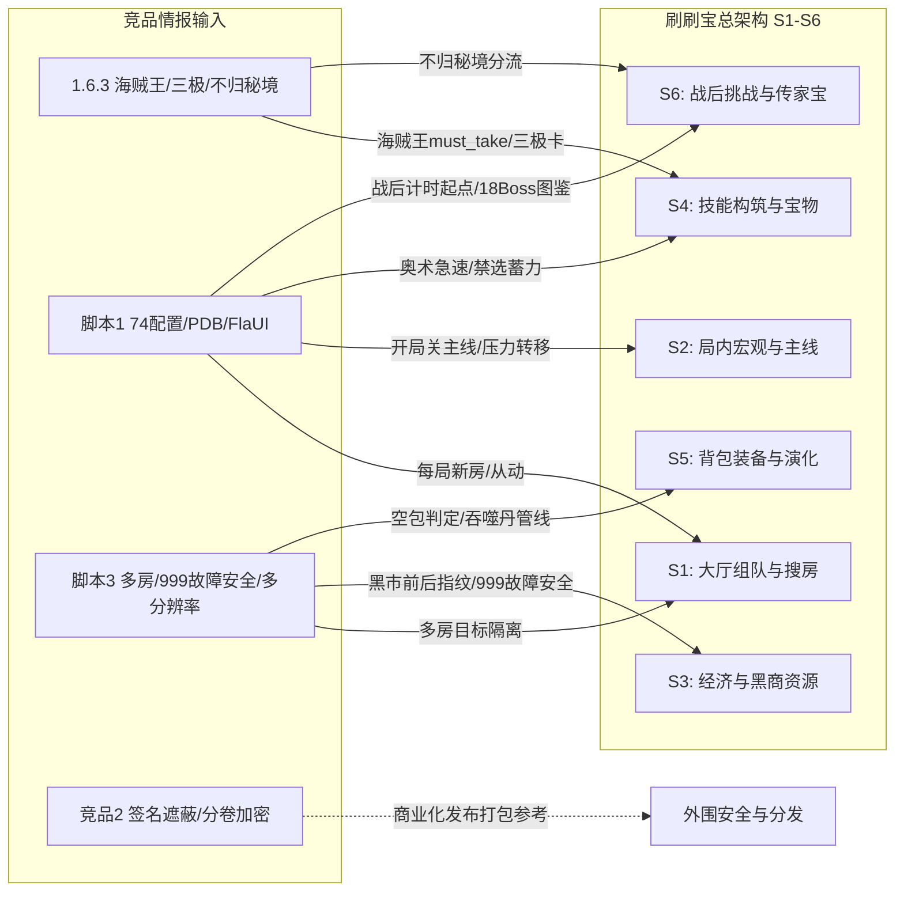

# 竞品深度拆解知识总图与交接索引 (COMPETITOR KNOWLEDGE INDEX)

> **版本**：2026-09-23  
> **基线**：`docs/architecture/COMPETITOR_KNOWLEDGE_SYNTHESIS_20260910.md` 与 `docs/research/20260922/`  
> **样本真源**：`C:\Users\10639\Desktop\竞品\`（脚本1 1.6.2 / 1.6.3、参考脚本3、竞品2 / 刷刷护肝宝92、竞品分析资产）  
> **红线规约**：严禁修改 production 代码；严禁在沙箱/宿主运行竞品 EXE；竞品结论仅出「三栏裁决 + 差距项」，拿卡默认值由 `HANDOFF_PROMPT_FOR_ARCHITECT.md` 仲裁。

---

## 1. 文档全景地图与导航

| 分类 | 文档路径 | 核心覆盖内容 |
| :--- | :--- | :--- |
| **交接入口** | [`COMPETITOR_KNOWLEDGE_INDEX.md`](file:///C:/Users/10639/work/shuashuabao/docs/handoff_20260923/COMPETITOR_KNOWLEDGE_INDEX.md) | 本文：全文档地图、Top 3 情报项、三栏裁决与架构对接点 |
| **交接入口** | [`HANDOFF_PROMPT_FOR_COMPETITOR_ANALYST.md`](file:///C:/Users/10639/work/shuashuabao/docs/handoff_20260923/HANDOFF_PROMPT_FOR_COMPETITOR_ANALYST.md) | 可直接粘贴的竞品分析 Agent 启动提示词、REJECT 红线与 Backlog |
| **总架构接口**| [`HANDOFF_PROMPT_FOR_ARCHITECT.md`](file:///C:/Users/10639/work/shuashuabao/docs/handoff_20260923/HANDOFF_PROMPT_FOR_ARCHITECT.md) | 架构师交接提示词、L0~L3 机制清单、审查 Checklist |
| **总架构总图**| [`STRATEGY_MODULE_MAP_FOR_ARCHITECT.md`](file:///C:/Users/10639/work/shuashuabao/docs/handoff_20260923/STRATEGY_MODULE_MAP_FOR_ARCHITECT.md) | 全机制四层（L0~L3）决策分模块总图、实机推翻表、P0~P2 实施路线 |
| **深度拆解正文** | [`docs/research/COMPETITOR_FULL_ANALYSIS_20260922.md`](file:///C:/Users/10639/work/shuashuabao/docs/research/COMPETITOR_FULL_ANALYSIS_20260922.md) | 三家总矩阵 + §7.5 缺口审计 + 1.6.2 新 Boss/时光之穴 57 项 |
| **深度拆解正文** | [`docs/research/COMPETITOR_FEATURE_EXCLUSIVITY_MATRIX_20260923.md`](file:///C:/Users/10639/work/shuashuabao/docs/research/COMPETITOR_FEATURE_EXCLUSIVITY_MATRIX_20260923.md) | 独占/缺失横向对比；大厅找房/蹭车从动机制对照 |
| **深度拆解正文** | [`docs/research/COMPETITOR_GAPS_DEEP_DIVE_LANDING_20260923.md`](file:///C:/Users/10639/work/shuashuabao/docs/research/COMPETITOR_GAPS_DEEP_DIVE_LANDING_20260923.md) | 稳定性看门狗 / 18 Boss 虚拟网格 / 3·4 选一几何自适应落地 |
| **样本专项** | [`docs/research/COMPETITOR_STATIC_OBSERVATIONS_1_6_2_20260922.md`](file:///C:/Users/10639/work/shuashuabao/docs/research/20260922/competitor/COMPETITOR_STATIC_OBSERVATIONS_1_6_2_20260922.md) | 脚本1 1.6.2 专项：界龟+55~57 Boss、命运骰子、战后计时语义 |
| **样本专项** | [`docs/research/COMPETITOR_STATIC_OBSERVATIONS_1_6_3_20260923.md`](file:///C:/Users/10639/work/shuashuabao/docs/research/COMPETITOR_STATIC_OBSERVATIONS_1_6_3_20260923.md) | 脚本1 1.6.3 增量：海贼王≠海盗辨析、不归秘境、三极顶级卡、PDB/XML 泄露分析 |
| **样本专项** | [`docs/research/COMPETITOR_SCRIPT1_SETTINGS_MAP_20260923.md`](file:///C:/Users/10639/work/shuashuabao/docs/research/COMPETITOR_SCRIPT1_SETTINGS_MAP_20260923.md) | 脚本1 Settings.cs 74 项配置属性与函数调用映射全景表 |
| **样本专项** | [`docs/research/COMPETITOR_STATIC_OBSERVATIONS_SCRIPT3_20260923.md`](file:///C:/Users/10639/work/shuashuabao/docs/research/COMPETITOR_STATIC_OBSERVATIONS_SCRIPT3_20260923.md) | 脚本3 Python 字节码逆向：传家宝多房配置、999 故障安全、关 Defender 严重红旗 |
| **样本专项** | [`docs/research/COMPETITOR_STATIC_OBSERVATIONS_COMP2_20260923.md`](file:///C:/Users/10639/work/shuashuabao/docs/research/COMPETITOR_STATIC_OBSERVATIONS_COMP2_20260923.md) | 竞品2 加壳包逆向：签名遮蔽 Overlay、6 分卷 QMCZIP、uservar 参数解析 |

---

## 2. 当前最优先 3 个增量情报项（含样本路径）

### 增量情报 1：脚本1 1.6.3「海贼王」新体系与独立「不归秘境」落点
* **样本路径**：
  * `C:\Users\10639\Desktop\竞品\脚本1更新\1.6.3\Images\haizeiwang.png` (2,506 B, 2026-09-22)
  * `C:\Users\10639\Desktop\竞品\脚本1更新\1.6.3\Images\haizeiwangEx.png` (6,133 B, 2026-09-22)
  * `C:\Users\10639\Desktop\竞品\脚本1更新\1.6.3\Images\buguimijing.png` (4,154 B, 2026-09-22)
  * `C:\Users\10639\Desktop\竞品\脚本1更新\1.6.3\Images\damingjiText.png` (2,812 B, 2026-09-21)
  * `C:\Users\10639\Desktop\竞品\脚本1更新\1.6.3\Images\lizhiji.png` / `minzhiji.png` / `zhizhiji.png` (力/敏/智之极)
* **核心事实**：
  1. 竞品在 1.6.3 紧急追加了 `haizeiwang.png` 与 `haizeiwangEx.png`，证明游戏近期更新推出了**「海贼王 (ONEPIECE)」跨品质宝物/专属体系**，且具备进化/升级态（Ex 标识）。它**绝不等同于**基础羁绊中的普通「海盗」！
  2. 新增 `buguimijing.png`（不归秘境），说明战后或秘境玩法新增了高阶落点分支，与常规大秘境（`damingjiText.png`）存在状态分流。
  3. 新增三极卡（力之极、敏之极、智之极），作为后期属性突破质变卡。

### 增量情报 2：脚本1 1.6.3 源码工程符号泄露（PDB + FlaUI XML）
* **样本路径**：
  * `C:\Users\10639\Desktop\竞品\脚本1更新\1.6.3\GameScript.pdb` (74,240 B, 2026-09-22)
  * `C:\Users\10639\Desktop\竞品\脚本1更新\1.6.3\Lan.UIAutomation.xml` (50,000+ B)
  * `C:\Users\10639\Desktop\竞品\脚本1更新\1.6.3\Lan.UIAutomationCore.xml` (200,000+ B)
  * `C:\Users\10639\Desktop\竞品\竞品分析资产\01_参考脚本1更新\反编译源码\GameScript.Models\Settings.cs`
* **核心事实**：
  1. 竞品构建未剥离 PDB 符号文件，且附带完整的 FlaUI UIAutomation 封装文档 XML；
  2. 结合反编译源码，竞品完整暴露了 **74 项核心设置字段**（详见 Settings 映射表），彻底揭开了其带队从动逻辑（`FollowTheLead`）、战后计时基准（`ArchiveBossTime` 自点击起算）、四关卡分层挑战（`SmallCJBoss1/2/3`）的真实实现。

### 增量情报 3：脚本3 传家宝多房配置 vs 关 Defender 严重合规红旗
* **样本路径**：
  * `C:\Users\10639\Desktop\竞品\参考脚本3\用户设置存档.json`
  * `C:\Users\10639\Desktop\竞品\参考脚本3\工程文件\一键关闭系统杀毒.zip`
  * `C:\Users\10639\Desktop\竞品\竞品分析资产\02_参考脚本3\分析报告\COMP3_TO_SHUABAO_TRANSFER_MAP.md`
* **核心事实**：
  1. 脚本3 配置明确包含 `"room_heirloom_bosses": [0, 0, 0]` 与 `"heirloom_boss_index": "15"`，支持在多开/不同房间差异化指派不同的传家宝目标；
  2. 脚本3 在其工程发布目录中捆绑了强制关闭 Windows Defender 杀毒软件的批处理/注册表（`一键关闭系统杀毒.zip`），属于恶意绕过合规防线的破坏性脚本。

---

## 3. 三栏裁决模板（应用 / 参考 / REJECT）

| 增量情报项 | 应用 (ADAPT & LAND) | 参考 (REFERENCE ONLY) | 严格拒绝 (STRICT REJECT) |
| :--- | :--- | :--- | :--- |
| **情报 1：海贼王与不归秘境** | 1. 提取 `haizeiwang` 与 `haizeiwangEx` 入 staging 图鉴，作为 P2 must_take 宝物； 2. 建立 `buguimijing` 独立判页锚点，防止误走普通退出。 | 观察海贼王在不同流派下的出牌优先级与 Ex 进阶条件；参考其力/敏/智之极在后期的加权策略。 | 严禁将「海贼王」与「海盗」羁绊混为一谈；严禁在缺乏真机证据时直接赋予海贼王破坏主线金币/木材账本的特权。 |
| **情报 2：脚本1 74 项设置与 PDB** | 1. 将战后计时看板参数（`ArchiveBossTime` 传家宝窗口）对齐竞品清晰心智； 2. 吸纳 `NewRoomEveryTimes`（每局新房）与 `AutoCloseMainLine` 作为用户可配置项。 | 参考其多开从动设计（`FollowTheLead`）；参考其 FlaUI 的控件模式枚举（我方已有原生 UIA）。 | 严禁抄袭其 `Thread.Sleep` 阻塞式任务流；严禁采用其固定 `(X, Y+40)` 盲点偏移与低鲁棒性绝对坐标。 |
| **情报 3：脚本3 多房与关 Defender** | 1. 吸纳房间级传家宝 Boss 目标定制模型（多开场景下隔离各房 Boss）； 2. 移植 COMP3 刷新否定证据与 999 故障安全语义。 | 参考其按场景（lobby/battle/settlement）三级资产组织结构规范我方素材管理。 | **绝对红线禁止**：严禁捆绑、运行或分发任何关闭杀毒/修改 Windows Defender 的脚本；严禁采用其 1366x768 屏幕绝对坐标硬锁。 |

---

## 4. 与总架构 S1–S6 阶段的对接点

### 具体对接映射：
* **S1（大厅搜房与组队）**：
  * 对接脚本1 `NewRoomEveryTimes` 模式，增强防炸房机制；
  * 对接脚本3 多房间差异化句柄与配置映射（`room_heirloom_bosses`）。
* **S2（局内宏观推进与主线）**：
  * 对接脚本1 `FollowTheLead`（主 C 滞后从动）与 `AutoCloseMainLine`，防止误冲 5-5 导致减员；
  * 固化开局 20s 压力转移判定。
* **S3（经济、赌木与黑商微机制）**：
  * 对接脚本3 刷新前后 ROI 像素哈希对比与 `999` 故障安全（采样失败永不误判为无变化）；
  * 对接我方已确立的黑商两段式原子预算（$\ge 440$ 杀敌）。
* **S4（技能构筑、羁绊与宝物决策）**：
  * 对接 1.6.3 新增的 `haizeiwang` / `haizeiwangEx` 跨品质保底策略（`must_take`）；
  * 引入 `lizhiji` / `minzhiji` / `zhizhiji` 顶级卡词典扩充；
  * 落实 19 种负面宝物（`treasure_debuff_catalog.json`）强制默认过滤。
* **S5（背包清理、装备与演化）**：
  * 对接脚本3 空槽位检测（`count_empty_slots`）防满包；
  * 维持黄金猿上阵前锁装备栏互斥校验。
* **S6（战后闭环、时光之穴与传家宝）**：
  * 对接 1.6.3 `buguimijing` 独立落点判定，防止战后秘境流程挂死；
  * 对接 1.6.2/1.6.3 全量 18 传家宝 Boss + 57 时光之穴 Boss 图鉴同步；
  * 修正战后计时语义：将挑战计时起点精确定位为「点击传家宝 Boss 之后」。

---

## 5. 与总架构交接接口（§3 规约）

依据 [`HANDOFF_PROMPT_FOR_ARCHITECT.md`](file:///C:/Users/10639/work/shuashuabao/docs/handoff_20260923/HANDOFF_PROMPT_FOR_ARCHITECT.md) 与 [`STRATEGY_MODULE_MAP_FOR_ARCHITECT.md`](file:///C:/Users/10639/work/shuashuabao/docs/handoff_20260923/STRATEGY_MODULE_MAP_FOR_ARCHITECT.md)：
1. **职责划分**：
   * **竞品包 (Competitor Pack)**：仅负责逆向提取事实、挖掘游戏更新暗坑、梳理竞品能力缺口与产出三栏裁决模板。严禁直接对生产代码发指令。
   * **总架构 (Architect)**：负责规则合并、拿卡优先级与默认值敲定、纯函数调度器契约审查与 P0~P2 代码落地。
2. **数据流通单向性**：
   $$\text{竞品提取样本/事实} \xrightarrow{\text{三栏裁决}} \text{Perception/Catalog Staging} \xrightarrow{\text{真机测试核验}} \text{总架构正式注入 Production}$$
   未经真机验证的竞品数据，绝不可直接进 `src/shuabao/`。

---

## 6. 报告署名与审计签署

* **报告编制人**：Antigravity Pair Programming Agent
* **署名模型**：**Gemini 3.8 Flash (High)**
* **交付目标**：下一任交叉审计 Agent（Cross-Audit / Reviewer Agent）及总架构决策 Agent
* **交付基准**：`origin/feat/solo-shadow-scheduler-20260922`（commit `cbd49de` / `4fbb884`）与桌面竞品资产
* **签署日期**：2026-09-23
* **审计状态**：拆解正文已完备，等待独立交叉审计

