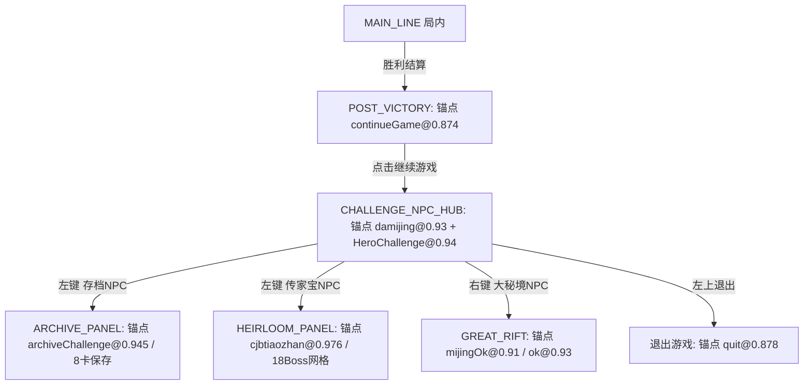
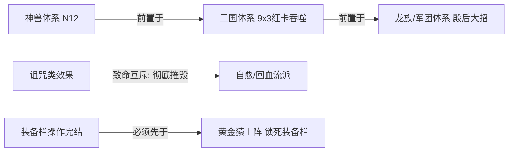

# 《重生魔兽刷刷刷》策略机制分模块总图与实机架构审查补充件

> **文件定位**：全机制分模块总图（L0~L3）+ 实机真实事实与推翻表 + 深度盲区补充建议 + P0/P1/P2 落地路线图  
> **文档基线**：`afc3443` / `4fbb884`（`origin/feat/solo-shadow-scheduler-20260922`）  
> **审查与编写人**：Antigravity (Pair Programming Agent)  
> **交付目标**：总架构 Agent / Reviewer Agent 跨阶段审查与交叉核验  
> **签署日期**：2026-09-23  

---

## 〇、 架构总览：四层决策引擎模型 (L0 ~ L3)

本架构用于彻底替换原有 888KB 过程式单体 [`mediator.py`](file:///C:/Users/10639/work/shuashuabao/src/shuabao/mediator.py)，建立确定性、高内聚、契约驱动的决策体系。

```
┌────────────────────────────────────────────────────────────────────────┐
│ L0 大机制生命周期与上下文仲裁 (Macro Lifecycle & Context Arbitration)    │
│  - 单人(Solo) / 混车(Hitch) 策略掩码 (20s压力转移 / 主线从动 / 房主离场)   │
│  - 局内主线推进 (1-1 ~ 5-5) 与 局外战后闭环 (胜利 -> 8卡存档 -> 广场 -> 传家宝) │
│  - 动作租约 (Action Lease) 与 Fail-Closed 熔断中断                          │
└───────────────────────────────────┬────────────────────────────────────┘
                                    │ 调度与预算约束
┌───────────────────────────────────▼────────────────────────────────────┐
│ L2 交叉矩阵与状态真源 (Cross-Cutting Constraints & Truth Matrix)         │
│  - 资源三本账隔离：木材 (F/赌木) | 杀敌货币 (H) | 刷新次数/券 (V/G/英雄)  │
│  - 计数器与 Need 物理隔离 (消除空开误伤，Need 取自静态 Catalog)            │
│  - 互斥/前置拓扑：神兽->三国 | 龙族军团殿后 | 诅咒↛回血 | 黄金猿禁装备   │
│  - 穿插推进范式：战力瓶颈 + 预算窗口驱动 (拒绝一刀切清空式轮换)           │
└───────────────────────────────────┬────────────────────────────────────┘
                                    │ 状态快照与事实输入
┌───────────────────────────────────▼────────────────────────────────────┐
│ L3 确定性决策流水线 (Deterministic Decision Pipeline / Shadow Scheduler) │
│  [槽位几何] -> [OCR归一] -> [族/阶段粗筛] -> [负面危险硬过滤] ->         │
│  [前置互斥校验] -> [高级组生命周期] -> [品质保底] -> [动作: 点/刷/隐]   │
│  - 三类事实严分：Observed / Requested / Confirmed (只有 Confirmed 推进账目)│
└───────────────────────────────────┬────────────────────────────────────┘
                                    │ 单一合法指令
┌───────────────────────────────────▼────────────────────────────────────┐
│ L1 原子微机制执行器 (Micro Mechanics Executors)                         │
│  - 技能 G: <=4系硬约束 / 关键质变点(23/30/46) / 蓄力射击必禁 / 零囤积损失 │
│  - 羁绊 F: 门卡=4 规则 (~1400木/链) / 高级组单推 (base>=80%) / 差1张抢选│
│  - 宝物 V: 19负面+2存疑默认禁拿 / must_take 跨品质保底 / 3与4槽位自适应  │
│  - 黑商 H: 纯杀敌计价 / 180s免费冷却 / 两段式原子预算 (刷新+购买>=440杀敌)│
│  - 装备/进化 E: 词缀防呆 / 黄金猿互斥 / 背包满仓防误拾取                 │
└────────────────────────────────────────────────────────────────────────┘
```

---

## 一、 L0 大机制：宏观生命周期与双模态掩码

### 1.1 单人 (Solo) 与混车 (Hitch) 双模态掩码
混车模式与单人模式在机制上存在不可混淆的不对称性，L0 必须配置上下文掩码（Mode Mask）：

| 机制维度 | 单人模式 (Solo) | 混车/蹭车模式 (Hitch) | 违规后果与防护 |
| :--- | :--- | :--- | :--- |
| **压力转移** | 不触发 / 禁用 | **开局 20 秒内必须检测并点击**（装备栏上方按钮，超时消失） | 超时未点导致无法替主 C 分担或机制脱节 |
| **主线推进 (1-1 ~ 5-5)** | 主动按自身战力推至最高 | **主线从动**：主线默认关闭，依据主 C 进度滞后开启（如主 C 达 2-6，我方才开至 2-4） | 擅自拉满主线将提前触发高阶怪导致灭队 |
| **房间与考古 (Archaeology)** | 按自身关卡规划挑战 | **跳过考古/声望房间**；非自建房不主动开声望挑战 | 误入未授权房间打乱房主节奏 |
| **房主离场中断 (Host Left)** | 无 | 弹窗检测到房主离开，**立即 Fail-Closed 走退出流程**，禁止尝试原地恢复 | 房主退出后继续挂机属于死循环无效消耗 |

### 1.2 战后闭环（Post-Game）与页面判级
基于实测截图（`fixtures/reborn_wow/endgame/`），战后页面共用顶部 HUD 元素（`(680, 55)` 处 score 0.955）。**严禁单凭顶部共用元素判定页面**，必须依赖专有复合锚点：



* **租约中断保护**：在 NPC 广场及各子面板中，所有点击必须携带动作租约（Action Lease）。若遭遇遮挡或无预期后置响应，直接 Fail-Closed 回退到广场重测，严禁盲猜盲点左上角 `quit`。

---

## 二、 L1 小机制：原子规范与操作红线

### 2.1 技能 G (Skill G)
* **$\le 4$ 系严格限制**：奥术箭（主）、奥术激光、奥术射线、剑气（或天雷、闪电链）；
* **时序真相（零过期 vs 战力断崖）**：
  * **机制事实**：技能点**无上限、不过期、无囤积损耗**；
  * **推翻历史缺陷**：废除旧脚本中“技能点积压 $\ge 8$ 紧急抢占面板”的荒谬设定；
  * **动作触发条件**：技能点投入仅受“战力短板与质变断崖”驱动。例如：奥术箭达到 23 级（急速成型）、30 级（血轮斩）、46 级（极限 0.24s CD）具有里程碑质变，在此窗口应集中投入。
* **绝对负面禁用**：**「蓄力射击」降低 50% 技能急速（-50% CD），任何流派下绝对禁止拿取（never_pick）**。

### 2.2 羁绊 F (Bond F)
* **门卡规则（gate_need = 4）**：智/力/敏门卡需打满 4 张方可解锁后续专属链。全链结构同构：
  $$\text{门卡}(4) \longrightarrow \text{中环}(4) \longrightarrow \text{次环}(3) \longrightarrow \text{UR}(3) \quad (\approx 14 \text{ 抽} \approx 1400 \text{ 木/链})$$
* **高级组单推原则**：
  * 仅当基础羁绊完成度（base）$\ge 80\%$ 时才允许开启高级组（海盗、三国、亡灵、封神等）；
  * **全局严格单并发**：同一时间内只能处于 1 个高级组的推进生命周期中，严禁双开高级组分散木材。
* **“差 1 张”插队规则**：一旦卡池刷出当前活跃链或合成件“仅差 1 张即可成型”的卡片，立即可抢占当前轮候顺序优先拿下。

### 2.3 宝物 V (Treasure V)
* **19 负面 + 2 存疑默认禁拿**：
  * 依据实机 25 帧 debuff 证据，19 类负面宝物（如减攻速 80%、禁装备栏、禁自然回血、每秒扣木）和 2 类存疑宝物，必须在 `choice_policy` 中通过单源 Catalog 默认全部过滤；
  * 仅当用户在配置中明确打勾 `allow_negative` 的特定条目方可放行。
* **跨品质保底（must_take）**：
  * 包含 `ONEPIECE`（海贼王体系核心）、七星龙渊组件等关键宝物，在候选面板中无视常规品质梯度，保底优先选取。

### 2.4 黑商 H (Black Market H)
* **货币纯度**：消耗**杀敌数**（非木材、非金币）；
* **免费冷却**：免费刷新周期为 **180 秒**；
* **单品收敛**：现行版本只购买**吞噬丹**（基准价 400 杀敌），其余属性书在当前策略下忽略；
* **两段式原子预算**：详见第三节深度补充。

### 2.5 装备与进化 E (Equipment & Evolution)
* **黄金猿禁装备栏互斥**：黄金猿上阵会永久锁死装备槽，所有装备穿戴、词缀洗练与合成必须先于黄金猿执行完毕；
* **背包状态感知**：拾取前检测物品栏空位，背包满仓时暂停拾取操作，避免在地板掉落物上无效空点。

---

## 三、 深度盲区与机制补充（基于实机 GT 与全网事实）

在整合 2026-09-22 实机事实与历史推翻清单后，以下 **5 项深水区机制** 必须由总架构明确纳入规范：

### 3.1 机制认知推翻与真源修正表
下表列出历史上攻略或旧代码中的错误假定，现已由实机 GT 彻底推翻，决策层严禁回退：

| 机制对象 | 历史错误说法 / 旧代码残留 | **实机核实真相（权威真源）** | 架构设计规约 |
| :--- | :--- | :--- | :--- |
| **体术羁绊** | 认定为“提供 10% 破甲” | **卡面为「斗气场域」：提供 80% 力量自适应伤害** | 体术为力量/物理爆发核心卡，非破甲工具卡；属性归属力量。 |
| **贪婪套装** | 认定套装效果给“150木+888杀敌+6000金” | **该数值为三散件各自收益之和；套装效果为「随机吞噬 4 张卡牌」** | 散件性价比极高；但若无保护机制，合成套装会吞噬关键卡！需严格防误吞。 |
| **木材单调性** | 假定“木材资源只增不减” | **实机已证实木材存在突发下降（事件消耗/特殊扣除）** | 预算模块禁止假设 $Wood_{t+1} \ge Wood_t$，预算预留需基于实时快照。 |
| **属性链通关** | 假定属性链整条跑通拿到最终 UR | **实测仅推进至 UR 环 (1/3) 即达到时间/木材效益拐点** | 链预算不能按完美 100% 规划，需具备中途收敛能力。 |

### 3.2 黑商“两段式原子预算”规范 (Refresh-Buy Atomicity)
* **痛点**：若黑商付费刷新需 40 杀敌，吞噬丹需 400 杀敌。若当前杀敌余额为 410，旧逻辑判定“410 $\ge$ 40 故允许刷新”，刷新后余额剩 370；此时哪怕面板刷出吞噬丹，也因余额不足无法购买，导致刷新费彻底打水漂，且目标商品随时间被刷走。
* **架构公式**：
  $$\text{CanPaidRefresh} \iff \text{Balance}_{\text{kill}} \ge \text{Cost}_{\text{refresh}} + \text{Cost}_{\text{target\_item}}$$
  以吞噬丹为例，杀敌余额必须 $\ge 40 + 400 = 440$ 杀敌，才允许下发付费刷新。严禁任何断头式单步刷新！

### 3.3 高级羁绊组的“停滞熔断与降级协议” (Stall & Downgrade)
* **痛点**：“同时只推 1 套高级组”若缺乏退出机制，一旦遇上某核心卡持续不出的极端概率，整局木材将被该高级组无底洞式吸干。
* **生命周期状态机扩展**：
  ```
  [OPEN: 启动卡就位] ──> [ACTIVE: 单推注入木材] ──> [FINISHED: 组装成型]
                               │
                       (木材消耗 > 2500 且进度停滞)
                               ▼
                       [STALLED: 熔断降级] ──> (释放木材锁，回退至基础属性链 1400木/条)
  ```
  触发 `STALLED` 后，高级组释放独占锁，系统回退至通用属性链保障基础数值，防止因一套高级卡手导致暴毙。

### 3.4 卡池稀释（Pool Dilution）与抽滤方差
* **机制事实**：部分卡牌达成满星或吞噬后，地图底层**并未**将其移出抽取池，导致其沦为“无效稀释牌”；而部分特定事件（`remove_pool`）会永久移出卡牌。
* **架构补充**：
  * 对不会被移出卡池的卡系，越到后期单次抽卡的有效期望越低；
  * L3 调度器在计算中后期抽取预算时，必须动态调高抽卡成本期望（引入稀释衰减因子），避免在已被稀释的卡池中过度洗练。

### 3.5 战后传家宝“虚拟滚动网格 (Virtual Scroll Grid)”
* **实机物理限制**（参见 [`tests/test_boss_challenge_20260922.py`](file:///C:/Users/10639/work/shuashuabao/tests/test_boss_challenge_20260922.py)）：
  * 传家宝 Boss 共有 18 个，弹窗可视区仅容纳 4~5 个槽位；
  * 选取高序号 Boss（如 17 号年兽、18 号暴掠龙）必须先滚动 1~4 次滚轮；
  * **弹窗内绝对禁止右键**（右键会打开装备掉落详情，打断挑战流程）；
* **架构规约**：
  * 执行器必须维护内部虚拟滚动偏移量 `(virtual_index, scroll_offset)`；
  * 发送挑战指令后，必须等待并确认 `cjbtiaozhan` 横幅消除或战斗加载状态（Confirmed），不可仅凭点击事件 `ok=true` 假定挑战已成功开始。

---

## 四、 L2 交叉矩阵与约束网络

### 4.1 资源三本账隔离原则
系统内部严格维护三本物理隔离的账本，任何模块不得擅自换算：
1. **木材账本（Wood）**：专属服务于 羁绊抽取（F）与 赌木（2000 起步）；
2. **杀敌账本（Kills）**：专属服务于 黑商（H）购买吞噬丹与属性投资；
3. **刷新账本（Refresh Tickets）**：专属服务于 宝物 V、技能 G 与 英雄卡 的重置。

### 4.2 互斥与拓扑偏序链


### 4.3 计数器与 Need 物理隔离
* **UI 计数器（Episode Counter）**：反映交互次数，易受空开面板、弹窗抖动误触污染；
* **需求真源（Catalog Need）**：由 `bond_stack_catalog.json` 静态规则与实机识别出的当前持有星级（`owned`）共同决定：
  $$\text{RemainingNeed} = \max(0, \text{CatalogNeed} - \text{ConfirmedOwned})$$
  严禁任何逻辑将 UI 点击累计数代入 `RemainingNeed` 计算。

---

## 五、 L3 决策流水线设计 (Pipeline & Shadow Scheduler)

决策引擎需作为一个**无状态、无副作用的纯函数**运行（如 [`solo_scheduler.py`](file:///C:/Users/10639/work/shuashuabao/src/shuabao/solo_scheduler.py)）：
输入快照 $\longrightarrow$ 输出单一裁决决策。

```
输入: Snapshot (ObservedFacts, ActiveTransaction, Budgets, Constraints)
  │
  ├── 1. 槽位几何检测 (Slot Inspection: 3/4 选一自适应，防 Tooltip 遮挡)
  ├── 2. OCR 词典归一化 (Canonicalization: 如 "奥数箭" -> "奥术箭")
  ├── 3. 族与阶段粗筛 (Faction & Stage Filter)
  ├── 4. 负面与危险硬过滤 (Debuff Hard Skip: 19 负面名单逐条拦截)
  ├── 5. 前置与互斥拓扑校验 (Prerequisite & Mutex Verification)
  ├── 6. 高级组生命周期仲裁 (Advanced Lifecycle: 检查单推锁与 STALLED 状态)
  ├── 7. 品质与必选保底 (Quality Tier Fallback & must_take 保底)
  └── 8. 输出决策:
         - CONTINUE_TRANSACTION (维持原事务)
         - RECOMMEND (输出动作 ID、证据引用与理由)
         - WAIT_OR_OBSERVE (信息不全，等待观察)
```

### 5.1 三类事实状态模型
* **Observed**：当前帧清晰可见的实测数据，含坐标与置信度；
* **Requested**：动作已下发至操作系统，但游戏尚未产生可证明的状态变化；
* **Confirmed**：游戏 UI 已出现业务后置证据（如卡槽点亮、余额扣除、横幅消失）。**唯有 Confirmed 可以推进账本和卡牌持有量**。

---

## 六、 实机调整路线图：P0 / P1 / P2 阶段规划

| 优先级 | 核心任务 | 交付件与测试保障 |
| :--- | :--- | :--- |
| **P0（安全底线与单源）** | 1. 传家宝 Boss 图鉴全量补全（18 Boss）并移除固定上限，改为票据预算制。<br/>2. 提取 19 种负面宝物单源配置文件 `treasure_debuff_catalog.json`，全流派默认拦截。<br/>3. 剥离 UI 点击计数器与业务 Need 计算。 | `test_p0_safety_arbitration.py`<br/>`test_treasure_negative_fixtures.py`<br/>`test_p0_devour_failclosed.py` |
| **P1（状态机与物理交互鲁棒）** | 1. 高级组生命周期状态机（OPEN/ACTIVE/STALLED/FINISHED）落地，支持熔断。<br/>2. 黑商两段式原子预算（$\ge 440$ 杀敌）与 180s 冷却物理计时器。<br/>3. 1600x900 画面下 3/4 选一自适应几何计算，防 Tooltip 遮挡。<br/>4. 战后多锚点复合判页，消除顶部共用 HUD 误判。 | `test_p1_scheduler_and_f4.py`<br/>`test_boss_challenge_20260922.py`<br/>`test_treasure_layout_tie_20260912.py`<br/>`test_p1b0_post_game.py` |
| **P2（实验档与策略进阶）** | 1. 海贼王（ONEPIECE）跨品质保底实验档。<br/>2. 房间级传家宝定制偏好（指定房号挑战特定 Boss）。<br/>3. 发育型 vs 极限上限型宝物动态打分评估模型。 | `test_solo_core_development.py`<br/>`test_policy_near_complete.py` |

---

## 七、 署名与审查签署

* **架构审查人**：Antigravity Agent (Advanced Agentic Coding Pair Programmer)
* **对接分支**：`origin/feat/solo-shadow-scheduler-20260922`
* **结论**：本模块总图与补充分析已完整对齐实机 GT 事实、Owner 口述约定及历史推翻表。建议总架构 Agent 依据上述 P0 $\to$ P1 $\to$ P2 路线图推进 L1/L3 实施收口。
