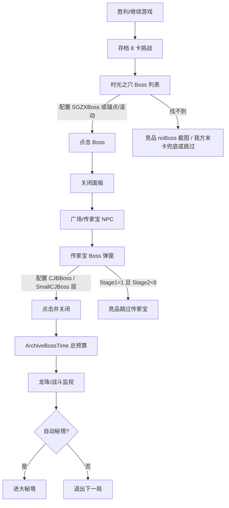

# 刷刷宝 · 全量竞品分析（2026-09-22）

> **定位**：产品/能力/风险三维对照，覆盖竞品脚本1（GameScript，含 1.6.2 增量）、脚本2（按键精灵打包）、脚本3（Python 自动化）。  
> **证据源**：  
> - `C:\Users\10639\Desktop\竞品\脚本1更新\1.6.2`（包面 + 文档 + 模板 + config）  
> - `C:\Users\10639\Desktop\竞品\竞品分析资产\`（既有反编译/字节码/资产质检）  
> - 本仓库 `docs/architecture/COMPETITOR_KNOWLEDGE_SYNTHESIS_20260910.md`  
> - 本仓库 `docs/research/COMPETITOR_STATIC_OBSERVATIONS_1_6_2_20260922.md`（1.6.2 专项）  
> **红线**：竞品结论不是我方 production 配置；坐标/阈值/默认 Boss 必须真机验证后才能接线。本文只读静态，未运行竞品、未发输入。

---

## 0. 一页结论

| 维度 | 脚本1 GameScript | 脚本2 按键精灵包 | 脚本3 Python | 刷刷宝 |
|---|---|---|---|---|
| 主技术栈 | C# / .NET 4.8 + OpenCvSharp + Tesseract | VMP 壳 + XOR 分卷 ZIP 载荷 | Python + cv2 + pyautogui | Python 3.11 + OpenCV + PaddleOCR/RapidOCR + SendInput + UIA |
| 输入 | PostMessage/点击矩形 | 按键精灵事件 | pyautogui 绝对坐标 | Win32 SendInput + 前景/UIPI 防护 |
| 感知 | 模板 + 少量 OCR | 脚本内模板 | 模板 + OCR，多分辨率资产 | 多尺度模板 + OCR 兜底 + 帧健康检查 |
| 状态机 | 嵌套 while + Sleep | 热键/子程序 | 平铺轮询 + 计数器 | Mediator FSM + 契约测试 |
| 失败策略 | 超时后点固定框 / 截图 | 人工接管强 | 循环重试 / 重置 | **Fail-Closed 零输入** + incident |
| 商业化 | 在线授权+证书+多开计价+飞书通知+画中画 | 加密载荷+签名遮蔽 | 有更新器 | 卡密/订阅已有；资产明文 |
| 1.6.2 关键增量 | 新 Boss 21/55–57、命运骰子模板、空神器槽、技能模板扩容 | — | — | 对应素材缺口见 §3 |

**总评**：脚本1 产品完成度与游戏内容跟进速度最快（图鉴/模式/通知闭环）；脚本2 打包防逆向最狠；脚本3 多分辨率资产最细。刷刷宝在**感知可靠性、状态隔离、可回归证据链、Fail-Closed 安全**上已明显更好，短板是**游戏内容图鉴同步慢、用户可见配置粒度、失败取证自动化、商业化打包**。

---

## 1. 竞品 A · 脚本1 GameScript（含 1.6.2）

### 1.1 产品面

- **模式**：独狼 / 带队（车头自动开始+每局新房）/ 赌木（强制 OSK，找到赌木暂停+飞书通知）/ 邪修秘境（独立模式，只打 Boss）/ 多开车头。
- **自动能力**：秘境（可 ContinueMiJing）、F4 过 5-5 清怪关主线、间隔清理（分解装备/传家宝/合成宝石）、奥数增伤卡序、可关羁绊/武器升级、自动声望（可 ContinueReputation）、神器 1–3 槽定时放、提前挑战、龙珠找取、存档/时光之穴/传家宝战后链。
- **易用性**：环境检测按钮、鼠标悬停说明、三参数醒目提示、飞书 Webhook 教程、在线授权。
- **分辨率契约**：**写死 1600×900 + 缩放 100% + 单屏 + 窗口化**（比我们严苛，但用户支持成本低）。

### 1.2 工程面（反编译 + 1.6.2 包面）

| 能力 | 竞品做法 | 评价 |
|---|---|---|
| 战后 Boss | 存档 8 格点击 + `bossChallenged` 短路 → SGZX 编号锚点/滚动 → CJB NPC 模板/OCR「家宝」 | 链路完整；OCR 过宽、坐标偏移 `Y+40` 脆 |
| 楼层覆盖 | SmallCJBoss / 2 / 3 按楼层切换 | 我方暂无此需求 |
| 声望分叉 | Reputation* 独立 Boss 配置 | 与我方 reputation_* 字段对齐 |
| 计时 | `ArchiveBossTime` 从点传家宝 BOSS 起算总预算；`BoosLiveTime`/`KillBossNum` 管邪修；`DevelopTime` 发育；`QueryTimeOut`/`GameTimeOut` | 参数多但语义清晰，有日志回显剩余秒 |
| 神器 | `ArtifactMode≥1/2/3` + `ArtifactDelay`，固定 LTRB 盲点 | 我方图标判空 + CD 更安全 |
| 取证 | `CaptureWin("noBoss"|"cjb_fail"|...)` | 失败截图习惯好 |
| 配置 | `userSettings` 十余关键键可序列化 | 我方 JSON + 看板已更好 |
| 滚动 | `NumberOfScroll` 次滚轮 | 无“到底/网格指纹”，易过滚 |

### 1.3 1.6.2 增量摘要（详见专项文档）

1. **传家宝图鉴 +`21界龟`**  
2. **时光之穴图鉴 +`55吞咽者布鲁`、`56狩猎者阿娅米斯`、`57无疤者奥斯里安`**  
3. **命运骰子**模板（1★ 负面→0）  
4. **emptyArtifact** 空神器槽  
5. **技能/卡面模板**批量新增（刷刷刷、超级水桶腰、感电、许愿、破甲强弩、火乱支援、混乱转换、剑气纵横、剑士增幅、急速射击、攻速提升等）  
6. 文档仍停在 1.9 / v2.0，**无正式 changelog**——跟进靠资源文件时间戳，对用户不友好。

### 1.4 可借鉴（YES）

1. **图鉴与版本跟进节奏**：新 Boss/新卡 1–3 天内补模板（文件时间可见）。我方应建立「游戏更新 → 图鉴 diff → catalog PR」流水线。  
2. **战后链参数化**：发育时间 / 存档挑战时间 / 等待时间 三参数向用户说清；我方战后预算 300s 等可暴露为可读配置。  
3. **模式隔离**：邪修秘境“其他功能无效”降低误操作面；我方 hitch/solo/reputation 已分模式，可再收束 UI 开关。  
4. **失败即截图**：`CaptureWin` 语义可对齐我们 incident archiver 的默认动作。  
5. **飞书/群通知契约**：赌木暂停、单局超时推送；我们已有 live.lock/日志，缺的是用户可配 Webhook。  
6. **`bossChallenged` 状态词**：真机采集时作候选状态；**不要**据此做“今日不再挑战”。  
7. **楼层换传家宝 Boss**（SmallCJBoss 1/2/3）：若我方用户提出“按关换目标”，配置模型可预留。  
8. **编号锚点找 Boss**（`NN*.png` + `%4` 锚）：真机滚动找不到时，可作辅助定位实验（须两帧确认）。

### 1.5 必须拒绝（REJECT）

1. 1600×900 唯一分辨率硬锁（我们保持 wide/scale）。  
2. 固定 LTRB 盲点神器/按钮（Contract 已禁颜色/坐标兜底进房；局内神器也应用槽位证据）。  
3. OCR 关键字「家宝」宽匹配单独授权点击。  
4. 模板命中 `Y+40` 固定点击偏移（应点标签下方几何中心或卡面可点击区）。  
5. 把 `ArchiveBossTime` 耗尽当成 Boss CLEAR。  
6. 为「已挑战」做次数/记忆停手（与用户 2026-09-13 拍板冲突）。  
7. 超时后无条件点继续游戏固定矩形。

### 1.6 对我方的优先行动（P0–P2）

| 优先级 | 行动 | 落点 |
|---|---|---|
| P0 | 同步 4 个新 Boss 模板入 `assets` + 修正 `challenge_boss_catalog.json`（并核查传家宝末项「莫阿姆」是否串到时光之穴） | 感知/图鉴 |
| P0 | 命运骰子真机帧：卡面、星级、选择策略；决定是否进 `choice_policy`/treasure 白名单 | 决策 |
| P1 | 空神器槽证据：对照 `emptyArtifact`，强化 `_slot_has_artifact` 或双证据 | L1 |
| P1 | 战后时间参数看板可读化（存档挑战预算 / 传家宝窗口 / 发育时间），文案对齐用户心智 | Shell |
| P2 | 失败路径默认落 incident 截图包（学 CaptureWin 命名） | 恢复/取证 |
| P2 | 用户可配飞书 Webhook 通知（超时/紧急停止/连局异常） | Shell |
| P2 | 游戏更新侦察：新模板文件名 → 自动开「图鉴缺口」任务 | 流程 |

---

## 2. 竞品 B · 脚本2（按键精灵 / VMP 打包）

### 2.1 事实

- 32-bit GUI，~15.9MB，VMP 高熵壳 + **Authenticode 签名遮蔽**（证书区后挂 12.7MB XOR 分卷 ZIP）。  
- Loader 与业务解耦：`uservar_config.ini` + `package_1..6_qmcfile.zip`。  
- 静态几乎看不到业务特征图/文案。

### 2.2 评价

| 项 | 判断 |
|---|---|
| 运行可靠性 | 未做动态评测；按键精灵事件模型在游戏窗口焦点/UIPI 上弱于 SendInput+提权 |
| 防逆向/分发 | **三家最强**，商业保护可学 |
| 可维护性 | 分卷脚本利于热更，但调试/回归成本高 |
| 与我们关系 | **不迁移业务逻辑**；商业化打包可借鉴 |

### 2.3 可借鉴（打包/商业化）

1. Loader（提权+环境检测+解密）与业务内核分离。  
2. 模板图不要明文 PNG 长期裸奔（中长期：加密 Vault + 内存 `imdecode`）——注意与「可回归/可审计」平衡，研发路径保持明文，发行路径加密。  
3. 配置轻混淆、核心资产重保护。  
4. 多开/机器码授权的产品形态（我们卡密已有，可对照定价）。

### 2.4 REJECT

按键精灵绝对坐标、无页面身份复核、签名遮蔽用于对抗查杀（合规与信誉风险，**不采用**）。

---

## 3. 竞品 C · 脚本3（Python + 多分辨率资产）

### 3.1 事实（来自 `COMP3_TO_SHUABAO_TRANSFER_MAP.md` 等）

- 按场景目录管理资产（lobby/battle/settlement、good_cards/skills、1366×768 全套）。  
- 全局 `*_COORD` 绝对坐标权威（56 处），100% DPI 硬前置。  
- 反刷/清理/传家宝/存档 Boss 多为 accurate_click + sleep。  
- 有 refresh 前后槽位哈希、999 故障安全值、PID+视觉冲突即停等**局部**好模式。

### 3.2 迁移结论（沿用既有 FINAL VERDICT，不重复证明）

- COMP3 反编译完整度足够；**资产不应直接进我方生产库**。  
- **值得搬的方法**：refresh 否定证据分层、999 故障安全、同位 N 连点仍在=资源不足、检疫不重置活性时钟、PID 与视觉冲突即停。  
- **长期 REJECT**：绝对坐标权威、DPI 硬锁、固定 NPC/HEIRLOOM 坐标链、completed_runs 混失败局、小模板降阈值到 0.74。

### 3.3 仍适用的 TOP-5 低成本升级（G0 语义，需按当前主干重核行号）

1. 刷新前保留指纹，失败采样 = 不判“无变化”。  
2. 检疫分支不刷新主循环活性时钟。  
3. merchant 同槽位指纹连续不变 → 正向停，不烧满 reroll。  
4. 大厅平面色按钮族：HSV 蓝/OCR 二次证据后再提阈值。  
5. 清理死模板/死 fallback 键/重复 kk_start 族。

### 3.4 对 1.6.2 的补充价值

脚本3 的**分场景、分卡片命名资产**（`good_cards/NN_名称_层级`）适合我方做「新卡/新 Boss」入库规范；比脚本1 扁平 `Images/` 更易 diff。

---

## 4. 能力矩阵（刷刷宝 vs 最强竞品）

| 能力域 | 最强竞品 | 刷刷宝现状 | 差距动作 |
|---|---|---|---|
| 大厅 L0 | 脚本1 车头/密码/每局新房 | UIA 建房，禁颜色兜底 | 补「每局新房」产品项 |
| 局内选卡 | 脚本1 奥数增伤/可关羁绊 | 纯策略 choice_policy + 词典 | 补新卡模板+命运骰子策略 |
| 神器 | 脚本1 三槽定时 | CD+槽位判空 | 空槽模板双证据 |
| 战后存档/时光/传家宝 | 脚本1 全链+声望分叉 | 全链+末卡兜底+OCR 兜底 | **补 4 Boss 图鉴**；修 catalog 串项 |
| 秘境/团本 | 脚本1 自动秘境+ContinueMiJing | 有自动秘境/大秘境确认 | 成功不退出问题对齐竞品已知坑 |
| 背包清理 | 脚本1 间隔分解/合成 | 有公共背包链 | 清理品质/锁的用户规则对齐 |
| 恢复/安全 | 弱 | Fail-Closed + Shift+F12 + 契约 | 保持优势 |
| 测试与证据 | 弱 | release_gate + 冻结回放 + 真实帧 | 保持优势 |
| 多开/通知 | 脚本1 飞书+画中画 | 弱 | P2 通知 |
| 分发保护 | 脚本2 | 明文资产+PyInstaller | 中长期 Vault |
| 分辨率适应 | 脚本3 多分辨率包 | wide 1.47x scale | 按需扩 scale，不抄 1366 硬锁 |
| 授权计价 | 脚本1 日/周/月多开 | 卡密/订阅 | 对照定价与多开 |

---

## 5. 时光之穴 / 传家宝专项对照

| 点 | 竞品 1.6.2 | 刷刷宝 | 同步动作 |
|---|---|---|---|
| 传家宝 Boss 数 | 21（含界龟） | catalog 21 但末项疑似错标 | 真机核对 + 补 `21界龟` |
| 时光之穴 Boss 数 | 57（含 55–57） | catalog 54 | 补 3 模板 + 序号 |
| 未解锁处理 | 编号锚点 `%4` 试探 + 滚动 | 顺序 + 末卡 + 不解锁跳过 | 保持我方 Fail-Closed；锚点仅实验 |
| 已挑战 | 模板短路 | 用户要求全点，不识别次数 | **不抄** |
| 计时起点 | 点传家宝 BOSS 后 | 战后预算 300s / 传家宝 60·120s | 看板暴露；不混同 CLEAR |
| 楼层换 Boss | SmallCJBoss 1/2/3 | 无 | 收集用户需求再做 |
| 命运骰子 | 有 1★ 模板 | 仅旧词典条目 | 真机策略单独立项 |

---

## 6. 建议路线图（可执行、可门禁）

### Sprint A · 图鉴与内容同步（感知层）

1. 从竞品 1.6.2 只读拷贝 4 个 Boss 模板到内部 staging（**不直接进 production `assets`**，先跑 `tools/validate_scenes.py` 式质检 + 与我方既有图鉴命名规范对齐）。  
2. 人工/真机确认名称与序号后，更新 `challenge_boss_catalog.json`，注释改为「与竞品 1.6.2 Images 对齐（待真机）」。  
3. 核查 catalog 传家宝末项「莫阿姆」；若是数据错误，开独立修复 commit（Perception 层）。  
4. 新技能/卡面模板清单写入图鉴 backlog（许愿、破甲强弩、感电…）。

### Sprint B · 策略与配置（决策/Shell）

1. 命运骰子：真机帧 → `choice_lexicon` 升级 version_seen → 决定 treasure 优先级（默认保守：可配置开关，默认不抢核心宝物位）。  
2. 看板战后参数文案：「存档挑战预算（自点击传家宝 Boss）」对齐竞品心智。  
3. （可选）楼层→传家宝 Boss 映射配置，默认关。

### Sprint C · 可靠性（恢复/取证）

1. 失败路径强制 incident 截图（命名含 step/reason）。  
2. 神器空槽双证据（图标 + `emptyArtifact` 语义）。  
3. merchant/刷新 否定证据（COMP3 TOP-5）合入时走 C2 契约与冻结回放。

### Sprint D · 产品/发行（可选）

1. 飞书 Webhook 通知。  
2. 发行资产 Vault 评估（不影响研发明文与测试）。  
3. 定价/多开对照脚本1。

**门禁**：任何接线改动 `python tools/release_gate.py` 退出码 0；禁止合成帧声称新 Boss 识别已实机通过。

---

## 7. 风险与合规注意

1. 竞品样本与反编译仅用于**互操作/安全/兼容研究**；不复制其代码、不共用密钥、不模仿其签名遮蔽对抗杀软。  
2. 用户协议与平台条款：自动化输入需管理员；避免传播绕过检测手法。  
3. 本文静态时间戳（如 2026-09-16）不能单独证明游戏版本功能新增，只能证明竞品补了资源。  
4. 我方 fail-closed 与「Boss 永不停机」是用户拍板的组合策略；不要用竞品的“超时继续点”替换。

---

## 8. 变更记录

| 日期 | 变更 |
|---|---|
| 2026-09-10 | `COMPETITOR_KNOWLEDGE_SYNTHESIS` 三家矩阵与 Top10/反模式 |
| 2026-09-22 | 1.6.2 静态观察扩写 + 本全量分析：新 Boss/命运骰子/空神器槽/战后计时语义/与我方 catalog 缺口 |
