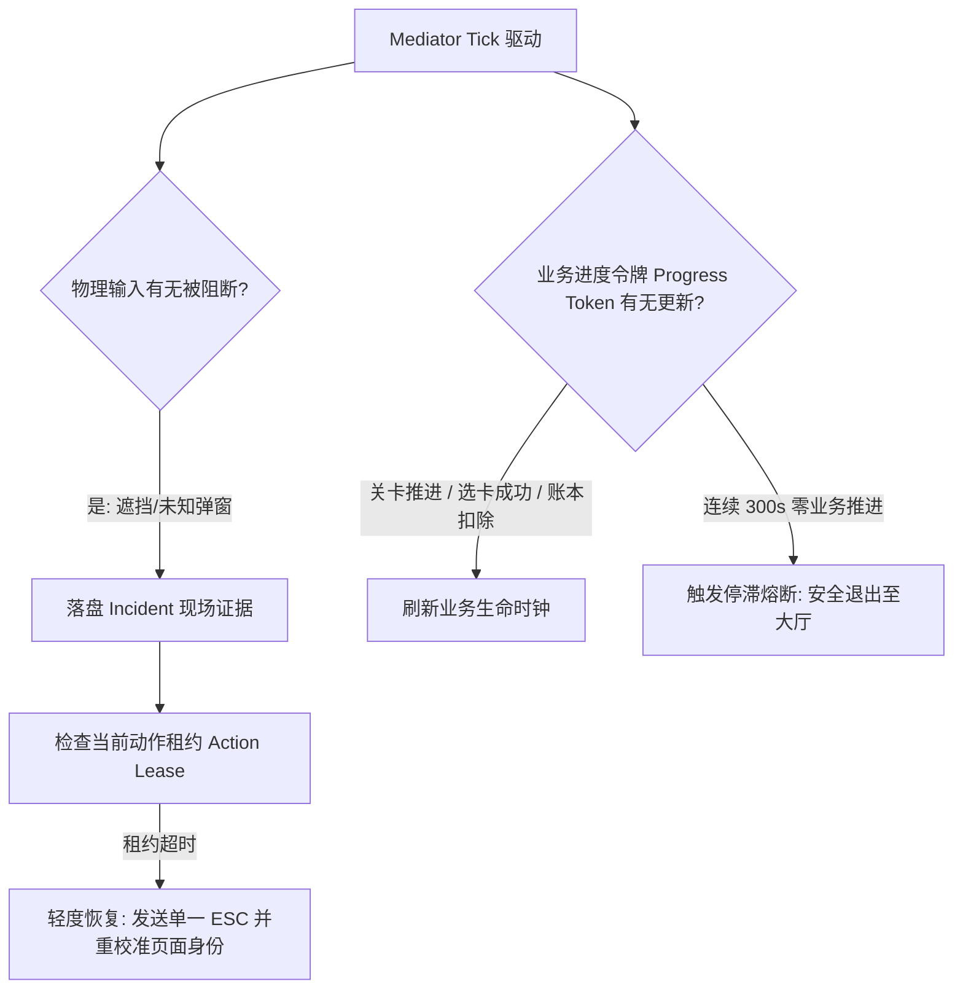

# 核心差距项深度落地：稳定性看门狗 / 18 Boss 虚拟网格 / 三·四选几何自适应

> **目标**：彻底解决当前实机运行中暴露的 3 大关键痛点，吸收竞品最佳工程实践，落实到具体技术契约与落地规范中。  
> **日期**：2026-09-23

---

## 一、 稳定性与看门狗：从“暴力脱困”到“业务进度令牌”

### 1.1 痛点剖析与竞品实机对比
* **竞品现象**：竞品1与竞品3在出现 UI 假死或未知遮挡时，用户普遍感觉“死不掉”；
* **逆向真相**：
  * 竞品1 (`AutoJob.cs`): 任何未知状态停留超过 5 秒，直接触发 `SendKeys("{ESC}")` $\times 3$ $\to$ 盲点主界面锚点 $\to$ 重启主循环；
  * 竞品3 (`_master_automation_loop_impl`): 依靠大漠全局看门狗计数，循环 N 次无果后直接杀掉弹窗。
  * **致命风险**：若处于不可逆业务（如高级装备合成、珍稀卡片四选一），暴力连按 ESC 或盲点大厅会导致关键奖励丢失甚至将装备分解！
* **刷刷宝现有缺陷**：原先采用纯心跳看门狗（Tick Heartbeat）。即使游戏已经卡在死循环面板中，只要 `mediator.tick()` 还在按频率执行，心跳就不会超时，导致整机卡死挂机数小时。

### 1.2 落地改进：业务进度令牌 (Business Progress Token)
建立分层看门狗架构，杜绝单纯心跳欺骗：



* **落地规范**：
  1. **刷新前后否定指纹**：吸收竞品3技巧，黑商刷新前对商品槽 ROI 计算像素哈希。刷新后 200ms 若哈希完全未变，记为 1 次否定样本；连续 2 次无变化立即进入 10s 冷却，**禁止连续烧完杀敌数**；
  2. **采样失败 999 语义**：若因分辨率抖动或窗口最小化导致像素比对失败，默认返回 `CHANGED=999`（假定有变化），防止因截屏故障误判资源耗尽。

---

## 二、 战后挑战闭环：18 Boss 虚拟网格与分层挑战

### 2.1 传家宝弹窗物理几何与滚动限制
依据实机真机截图与竞品配置分析：
* 传家宝弹窗可视区域仅容纳 **4~5 个槽位**；
* 传家宝 Boss 总数为 **18~21 个**（全量图鉴见下表）；
* 挑战高序号 Boss（如 15 猛虎之神、17 年兽、18 暴掠龙）必须进行 **1~4 次滚轮滚动 (`NumberOfScroll`)**；
* **弹窗内严禁右键**：在弹窗内部右键会唤起物品掉落详情浮层，破坏后续点击判定。

### 2.2 全量 Boss 图鉴补全清单 (P0)

```
[传家宝 Boss 图鉴]
1~14: 基础野兽与领主
15: 猛虎之神 (前期通用首选)
16: 远古龙
17: 年兽 (高防御特殊怪)
18: 暴掠龙 (超高物理爆发)
21: 界龟 (1.6.2/1.6.3 新增，需打满全额破盾)
*注：核查原 catalog 中「莫阿姆」疑似系时光之穴错标至传家宝，须隔离修正。

[时光之穴 Boss 图鉴 (1~57)]
1~54: 常规时光领主 (39 号拉格纳罗斯为中后期热门)
55: 吞咽者布鲁 (1.6.2 新增)
56: 狩猎者阿娅米斯 (1.6.2 新增)
57: 无疤者奥斯里安 (1.6.2 新增)
```

### 2.3 关卡分层挑战落地策略 (Tiered Boss Selection)
吸收竞品1的 `SmallCJBoss 1/2/3` 设计：
* **阶段 1 (开局至 2-6)**：战力低，强制锁定 `15猛虎之神`；
* **阶段 2 (3-1 至 5-5)**：羁绊初步成型，根据配置切换至中阶 Boss（如 18 暴掠龙）；
* **阶段 3 (通关后战后链)**：战力完全体，冲击顶级高阶 Boss（如 39 拉格纳罗斯或 21 界龟）。

---

## 三、 局内选卡：3 选 1 与 4 选 1 几何自适应

### 3.1 槽位自适应计算模型
不同游戏阶段与特权卡会动态触发「3 选 1」或「4 选 1」面板。严禁使用固定绝对坐标！

* **基准客户区**：$W \times H$（以 1600×900 为基准归一化）
* **面板区域**：水平居中，纵向 $Y_{\text{start}} \approx 0.18H$ 至 $Y_{\text{end}} \approx 0.48H$
* **槽位中心横坐标计算公式**：
  设候选数量为 $N \in \{3, 4\}$，面板有效可用总宽度为 $W_{\text{avail}}$，起始偏移为 $X_0$：
  $$X_i = X_0 + \frac{2i + 1}{2N} \times W_{\text{avail}}, \quad i \in [0, N-1]$$

### 3.2 悬停 Tooltip 遮挡防御
* **实机物理特性**：鼠标指针悬停在卡片文字区域时，游戏引擎会立即弹出大幅浮动说明框（Tooltip），将相邻卡片的标题或下一行文字彻底遮挡，导致后续 OCR 识别大面积报死！
* **点击落地规约**：
  1. **OCR 识别阶段**：鼠标指针必须收束在屏幕安全中立区（如客户区顶部 `(0.5W, 0.05H)`），严禁在候选区域乱晃；
  2. **动作下发阶段**：点击目标必须定位于卡片边框下沿点击热区（$Y_{\text{click}} = Y_{\text{card\_center}} + 35\text{px}$），杜绝直接击中卡片上方文字引发 Tooltip 残留。
