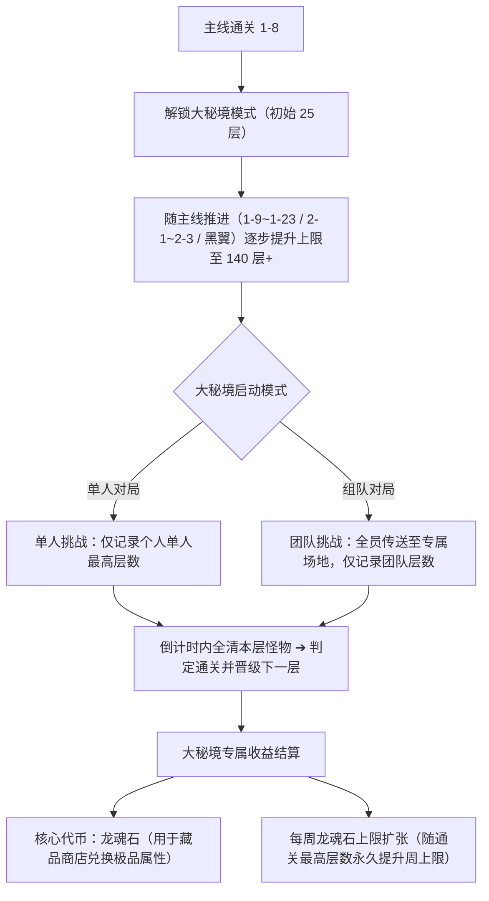

# 游戏关卡 1-1 至 1-23、2-1 至 2-3 及大秘境全量实机拆解报告

> **拆解员**：抽帧拆解临时工（板块 8）  
> **录屏素材来源**：`C:\Users\10639\Desktop\录屏素材\20260815_152149.mp4`（1920x1080，时长 174.47s）  
> **夹具资产目录**：[fixtures/stage_breakdown_20260815/](file:///C:/Users/10639/Desktop/🎮%20影音游戏/GameScript-Local/fixtures/stage_breakdown_20260815/)  
> **交接目标**：交接给检验官与知识库（KB），支撑选关状态机、卡组条件检测与大秘境调度策略开发。

---

## 一、第一章【旧世大陆】1-1 至 1-23 全量关卡实机拆解表

| 关卡编号 | 时间戳 | 关卡说明 / 开放机制 / 挑战解锁 | 开放卡组 | 大秘境开放 | 解锁技能 / 禁用次数 | 关卡普通怪与精英怪 | 关卡 BOSS 名单（按出场顺序） | 关卡奖励与挑战奖励 |
| :---: | :---: | :--- | :--- | :---: | :--- | :--- | :--- | :--- |
| **1-1** | `t=05.40s` | • 新手入门挑战 • 开放存档挑战：技能挑战 | **基础、刀刀、龙族、修仙元婴期** 羁绊卡组 | 基础未开放 | 解锁初始技能：**天雷** | 森林狼、火刃苦工、鱼人猎潮者、迪菲亚海盗 | **霍格**、**祈求者耶戈什**、**大范** | • 符文石 x60(+6) • 装备箱 x20(+2) • 关卡奖励效率+10% • 1星：击败最终进攻BOSS • 2星：击败5-5阿克蒙德 |
| **1-2** | `t=09.00s` | • 开放存档挑战：强化挑战 | **封神、大圣再临** 羁绊卡组 | - | 解锁初始技能：**剑气** | 鱼人猎潮者、迪菲亚海盗、幼龟、血鳃鱼人 | **曲奇**、**大范**、**克雷什**、**吞噬者穆坦努斯** | 同基础关卡奖励，通关解锁下一关卡 |
| **1-3** | `t=14.70s` | • 开放存档挑战：宝石挑战 | **修仙合体期** 羁绊卡组 | - | 解锁初始技能：**奥术激光** | 幼龟、血鳃鱼人、座狼、影牙狼人 | **克雷什**、**吞噬者穆坦努斯**、**吞噬者芬鲁斯**、**大法师阿鲁高** | 同基础关卡奖励 |
| **1-4** | `t=20.70s` | • 开放存档挑战：战利品挑战 • 开放卡组禁用（初始禁用次数 2 次） • 开放技能禁用（初始禁用次数 1 次） | **海盗** 羁绊卡组 | - | 解锁初始技能：**奥术射线** | 血鳃鱼人、座狼、影牙狼人、僵尸 | **吞噬者穆坦努斯**、**吞噬者芬鲁斯**、**大法师阿鲁高**、**巨型缝合怪** | 开启卡组与技能主动禁用槽位 |
| **1-5** | `t=27.59s` | • 开放存档挑战：密钥挑战 | **宝藏** 羁绊卡组 | - | 解锁初始技能：**冰霜新星** | 座狼、影牙狼人、骷髅战士 | **吞噬者芬鲁斯**、**大法师阿鲁高**、**巨型缝合怪**、**摩拉迪姆** | 同基础关卡奖励 |
| **1-6** | `t=33.29s` | • 开放存档挑战：时光之穴 | **三国** 羁绊卡组 | - | 解锁初始技能：**闪电链** | 影牙狼人、骷髅战士、报警机器人 | **大法师阿鲁高**、**巨型缝合怪**、**摩拉迪姆**、**瑟玛普拉格** | 同基础关卡奖励 |
| **1-7** | `t=37.79s` | • 通关后卡组禁用次数 +1 • 通关后技能禁用次数 +1 | **祈求** 羁绊卡组 （龙族卡组后续内容） | - | 解锁初始技能：**地震** （禁用次数各+1） | 骷髅战士、报警机器人、野猪 | **巨型缝合怪**、**摩拉迪姆**、**瑟玛普拉格**、**卡尔加** | 扩充禁用槽位 |
| **1-8** | `t=43.19s` | • 开放存档挑战：重铸挑战 • **开放英雄模式** • **开放传家宝挑战** | **异火** 羁绊卡组 | **正式开放大秘境模式** （上限 **25 层**） | 解锁初始技能：**龙卷风** | 骷髅战士、报警机器人、骷髅法师 | **摩拉迪姆**、**瑟玛普拉格**、**卡尔加**、**寒冰巫妖** | • 符文石 x120(+12) • 强化石 x40(+4) • 开启英雄与大秘境两大核心系统 |
| **1-9** | `t=48.89s` | • 传家宝挑战新增 BOSS：血腥猛犸 | **修仙大乘期** 羁绊卡组 | 开放至 **30 层** | 解锁初始技能：**电磁网** | 报警机器人、野猪、骷髅法师、猛虎 | **瑟玛普拉格**、**卡尔加**、**寒冰巫妖**、**虎王邦加拉什** | 高阶奖励 |
| **1-10** | `t=53.39s` | • 传家宝挑战新增 BOSS：洛卡纳哈 | **亡灵** 羁绊卡组 | 开放至 **35 层** | 解锁初始技能：**陨石** | 骷髅法师、猛虎、血色勇士、血色法师 | **寒冰巫妖**、**虎王邦加拉什**、**莫格莱尼**、**怀特迈恩** | 高阶奖励 |
| **1-11** | `t=57.29s` | • 通关后技能禁用次数 +1 | **军团** 羁绊卡组 | 开放至 **40 层** | 解锁初始技能：**飓风** | 猛虎、血色勇士、血色法师、远古守卫 | **虎王邦加拉什**、**莫格莱尼**、**怀特迈恩**、**阿扎达斯** | 技能禁用次数扩充 |
| **1-12** | `t=61.49s` | • 开放存档挑战：祝福挑战 • 传家宝挑战新增 BOSS：克雷什之父 | **神兽** 羁绊卡组 | 开放至 **45 层** | 解锁初始技能：**火球** | 血色勇士、血色法师、远古守卫、石灵 | **莫格莱尼**、**怀特迈恩**、**阿扎达斯**、**瑟莱德丝公主** | 祝福挑战与新神兽体系开启 |
| **1-13** | `t=65.39s` | - | - | 开放至 **50 层** | - | 血色法师、远古守卫、石灵、沙怒巨魔 | **怀特迈恩**、**阿扎达斯**、**瑟莱德丝公主**、**加兹瑞拉** | 大秘境层数扩容 |
| **1-14** | `t=68.69s` | - | - | 开放至 **55 层** | - | 远古守卫、石灵、沙怒巨魔、噩梦雏龙 | **阿扎达斯**、**瑟莱德丝公主**、**加兹瑞拉**、**伊兰尼库斯之影** | 大秘境层数扩容 |
| **1-15** | `t=71.69s` | - | **神通** 羁绊卡组 | 开放至 **60 层** | - | 石灵、沙怒巨魔、噩梦雏龙、黑铁矮人 | **瑟莱德丝公主**、**加兹瑞拉**、**伊兰尼库斯之影**、**索瑞森大帝** | 神通卡组核心进阶 |
| **1-16** | `t=76.19s` | • 开放存档挑战：技能挑战 2 • 传家宝挑战新增 BOSS：撼地兽 | - | 开放至 **65 层** | - | 沙怒巨魔、噩梦雏龙、黑铁矮人、龙人法师 | **加兹瑞拉**、**伊兰尼库斯之影**、**索瑞森大帝**、**维姆萨拉克** | 技能挑战 2 开启 |
| **1-17** | `t=80.98s` | • 传家宝挑战新增 BOSS：鳄王 | - | 开放至 **70 层** | - | 噩梦雏龙、黑铁矮人、龙人法师、食尸鬼 | **伊兰尼库斯之影**、**索瑞森大帝**、**维姆萨拉克**、**巴纳扎尔** | 传家宝扩充 |
| **1-18** | `t=84.28s` | • 传家宝挑战新增 BOSS：古龙龟 | **法宝** 羁绊卡组 | 开放至 **75 层** | - | 黑铁矮人、龙人法师、食尸鬼、憎恶 | **索瑞森大帝**、**维姆萨拉克**、**巴纳扎尔**、**瑞文戴尔男爵** | 法宝羁绊正式入池 |
| **1-19** | `t=87.28s` | - | - | 开放至 **80 层** | - | 龙人法师、食尸鬼、持盾骷髅 | **维姆萨拉克**、**巴纳扎尔**、**瑞文戴尔男爵**、**黑暗院长加林** | 大秘境层数扩容 |
| **1-20** | `t=90.28s` | • 传家宝挑战新增 BOSS：战争雷霆蜥蜴 | - | 开放至 **85 层** | - | 食尸鬼、持盾骷髅、龙人卫士 | **巴纳扎尔**、**瑞文戴尔男爵**、**黑暗院长加林**、**达基萨斯将军** | 传家宝扩充 |
| **1-21** | `t=93.58s` | • 刀刀卡组可进阶终极形态（可做 EX 刀刀大成） | **刀刀后续卡组** （开放进阶 EX） | 开放至 **90 层** | - | 持盾骷髅、龙人卫士、食人魔狂战士 | **瑞文戴尔男爵**、**黑暗院长加林**、**达基萨斯将军**、**戈多克大王** | 开启刀刀 EX 终极进阶路线 |
| **1-22** | `t=96.28s` | - | - | 开放至 **95 层** | - | 持盾骷髅、龙人卫士、食人魔狂战士、猎头巨魔 | **黑暗院长加林**、**达基萨斯将军**、**戈多克大王**、**加兹兰卡** | 大秘境层数扩容 |
| **1-23** | `t=98.08s` | • **通关后开启团本挑战**（仅解锁血神之祭简单难度） • 传家宝挑战新增 BOSS：钦原 | - | 开放至 **100 层** | - | 龙人卫士、食人魔狂战士、猎头巨魔、哈卡之子 | **达基萨斯将军**、**戈多克大王**、**加兹兰卡**、**血神哈卡** | **旧世大陆终章**，解锁第一代团本与 100 层大秘境 |

---

## 二、第二章【熔火之心】2-1 至 2-3 全量关卡实机拆解表

| 关卡编号 | 时间戳 | 关卡核心机制与热度值 | 团本与传家宝开放 | 大秘境开放 | 关卡小怪与精英怪 | 关卡 BOSS 名单（按出场顺序） | 挑战奖励与星级通关条件 |
| :---: | :---: | :--- | :--- | :---: | :--- | :--- | :--- |
| **2-1** | `t=108.88s` | • **热度值：10** • 熔火专属环境灼烧机制 | • **团本血神之祭开放【普通挑战】** • 传家宝挑战新增 BOSS：**马格纳斯** | 开放至 **105 层** | 火焰卫士、熔岩火人、炽炎猎犬、熔火犬 | **火焰行者**、**巨石火人**、**吞噬者图恩**、**玛格曼达** | • 符文石 x120(+12) • 强化石 x40(+4) • 1星：击败最终进攻BOSS • 2星：击败5-5阿克蒙德 • 3星：击败5-10基尔加丹 |
| **2-2** | `t=119.38s` | • **热度值：15** • 增强型熔岩环境特性 | • **团本血神之祭开放【困难挑战】** • 传家宝挑战新增 BOSS：**嗜血的索克** | 开放至 **110 层** | 熔岩火人、炽炎猎犬、熔火犬、火誓者 | **巨石火人**、**吞噬者图恩**、**玛格曼达**、**加尔** | • 符文石 x120(+12) • 强化石 x40(+4) • 3星通关额外赠送海量资源 |
| **2-3** | `t=124.18s` | • **热度值：20** • 极高环境热度与高频火系爆发 | • **团本血神之祭开放【地狱挑战】** • 传家宝挑战新增 BOSS：**战争之王** | 开放至 **115 层** | 炽炎猎犬、熔火犬、火誓者、地狱火魔 | **吞噬者图恩**、**玛格曼达**、**加尔**、**火牛贝利尔** | • 符文石 x120(+12) • 强化石 x40(+4) • **熔火之心关卡终章** |

---

## 三、扩展章节与高级团本实机特性

### 1. 【黑翼之巢】（录屏 `t=128.68s`）
- **环境机制**：每隔 **50 秒生成一颗龙蛋**（龙蛋为敌方单位，存活 30 秒后孵化，成功孵化后会随机诞生一只拥有强大光环效果的巨龙，龙蛋属性 100%）。
- **玩法解锁**：大秘境开放至 **140 层**，团本【火焰之心】开放普通挑战，传家宝挑战新增 BOSS【青蛙之神】。
- **关卡怪物与 BOSS**：红幼龙、小飞龙、红色雏龙、死爪地卜师；BOSS 为 **费尔默**、**埃博诺克**、**弗莱格尔**、**堕落的红龙**。

### 2. 【安其拉】（录屏 `t=135.57s`）
- **环境机制**：**沙尘暴 Lv1**，我方全体单位降低 **10% 命中率**。
- **玩法解锁**：团本【黑龙遗迹】开放普通挑战。
- **关卡怪物与 BOSS**：沙漠蜘蛛、其拉卫士、奥术守卫、其拉巡逻者；BOSS 为 **库林纳克斯**、**拉贾克斯将军**、**莫阿姆**、**吞咽者布鲁**。

---

## 四、【大秘境】系统全量规则与奖励机制

在录屏 `t=145.77s ~ 174.00s` 处，对大秘境界面及规则说明弹窗进行了全量抓取：

### 1. 核心挑战规则说明（实机原文逐字核对）
1. **进入与传送**：主机玩家在游戏内点击开启大秘境后，会在主机玩家处出现大秘境挑战传送门，全员传送至大秘境专属地图（独立存档挑战）。
2. **限时通关**：在规定时间内击杀该层所有敌人即视为通关成功并进入下一层；若倒计时结束未全清则挑战失败。
3. **单人与团队隔离**：
   - 多人组队局中，大秘境自动视为**团队挑战**，仅记录并更新团队历史最高层数；
   - 单人游戏中进行大秘境挑战时，视为**单人挑战**，仅记录个人单人最高层数。
4. **挂机收益暂停与专属产出**：
   - 处于大秘境期间，主线/大厅的挂机常规收益会**暂时停止**（包括每秒木材自然增长、每秒攻击收益等）；
   - 击杀大秘境中的专属怪物与 Boss 会掉落大量高额资源与材料补偿。

### 2. 奖励体系与【龙魂石】周上限提升规则
- **龙魂石核心作用**：大秘境产出专属核心货币【龙魂石】，层数越高获取速率越高，可在专属商店兑换极品藏品。
- **首次通关奖励**：首次击破指定里程碑层数时，会获得一次性丰厚首通奖励。
- **周上限永久提升梯度（实机抓取清单）**：
  - 每周一刷新周获取上限；
  - 通关 **135 层**：龙魂石周获取上限 **提高 1200**
  - 通关 **136 层**：龙魂石周获取上限 **提高 400**
  - 通关 **137 层**：龙魂石周获取上限 **提高 400**
  - 通关 **138 层**：龙魂石周获取上限 **提高 400**
  - 通关 **139 层**：龙魂石周获取上限 **提高 400**
  - 通关 **140 层**：龙魂石周获取上限 **提高 1200**
  - 通关 **141 层**：龙魂石周获取上限 **提高 400**
  - 通关 **142 层**：龙魂石周获取上限 **提高 400**

---

## 五、拆解员「问题 → 证据」事实对照表（交接给检验官）

> 拆解员仅如实陈述画面事实与时间戳，不作任何“对与错”的主观裁决。

| 序号 | 检验官/KB 关注问题 | 证据帧图片路径 | 录屏时间戳 | 画面客观事实描述 |
| :---: | :--- | :--- | :---: | :--- |
| **Q1** | 游戏各层羁绊卡组是如何随关卡解锁开放的？ | [fixtures/.../stage_1-1.jpg](file:///C:/Users/10639/Desktop/🎮%20影音游戏/GameScript-Local/fixtures/stage_breakdown_20260815/stages/stage_1-1.jpg) 等 23 张 | `t=5.4s ~ 98.1s` | 1-1 开放基础/刀刀/龙族/修仙元婴；1-2 开放封神/大圣；1-3 开放修仙合体；1-4 开放海盗；1-5 开放宝藏；1-6 开放三国；1-7 开放祈求；1-8 开放异火；1-9 开放修仙大乘；1-10 开放亡灵；1-11 开放军团；1-12 开放神兽；1-15 开放神通；1-18 开放法宝；1-21 开放刀刀后续（可做EX）。 |
| **Q2** | 大秘境模式从哪一关开启？层数上限如何演进？ | [fixtures/.../stage_1-8.jpg](file:///C:/Users/10639/Desktop/🎮%20影音游戏/GameScript-Local/fixtures/stage_breakdown_20260815/stages/stage_1-8.jpg) | `t=43.19s` 起 | 1-8 首次显示“开放大秘境模式（上限25层）”；其后 1-9 至 1-23 每层递增 5 层（30层~100层）；2-1 至 2-3 递增至 115 层；黑翼之巢递增至 140 层。 |
| **Q3** | 技能禁用与卡组禁用在何时解锁？上限是多少？ | [fixtures/.../stage_1-4.jpg](file:///C:/Users/10639/Desktop/🎮%20影音游戏/GameScript-Local/fixtures/stage_breakdown_20260815/stages/stage_1-4.jpg) | `t=20.70s` / `t=37.79s` / `t=57.29s` | 1-4 首次开放卡组禁用（初始 2 次）、技能禁用（初始 1 次）；1-7 通关后卡组禁用+1、技能禁用+1；1-11 通关后技能禁用+1。 |
| **Q4** | 2-1 到 2-3 的关卡特征与 1-x 有何显著不同？ | [fixtures/.../stage_2-1.jpg](file:///C:/Users/10639/Desktop/🎮%20影音游戏/GameScript-Local/fixtures/stage_breakdown_20260815/stages/stage_2-1.jpg) 等 | `t=108.88s ~ 124.18s` | 2-x 关卡带有明确的【热度值】（2-1 为 10，2-2 为 15，2-3 为 20），且每关均解锁更高等级的团本挑战难度（普通 ➔ 困难 ➔ 地狱）。 |
| **Q5** | 大秘境的组队与单人记录是否有区分？收益如何变化？ | [fixtures/.../stage_大秘境_规则说明.jpg](file:///C:/Users/10639/Desktop/🎮%20影音游戏/GameScript-Local/fixtures/stage_breakdown_20260815/stages/stage_大秘境_规则说明.jpg) | `t=156.27s` | 规则面板明确写明：多人局自动视为“团队挑战”仅记录团队层；单人局视为“单人挑战”仅记录个人层；大秘境中常规挂机收益（每秒木材/每秒攻击）会暂停，转为怪物击杀掉落。 |
